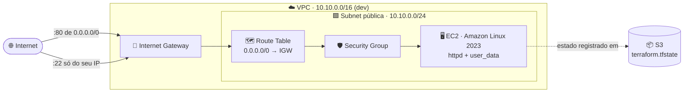
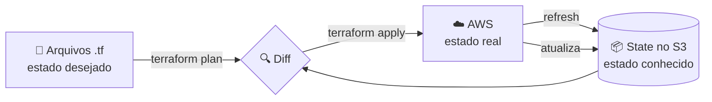
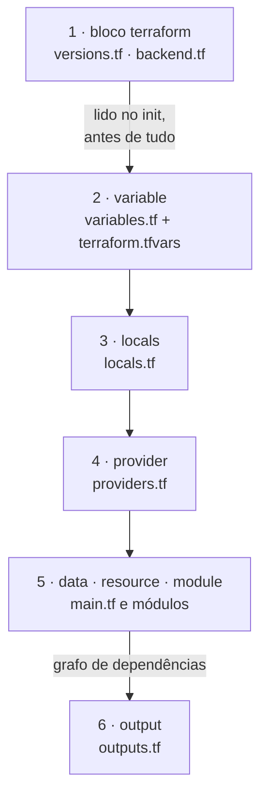
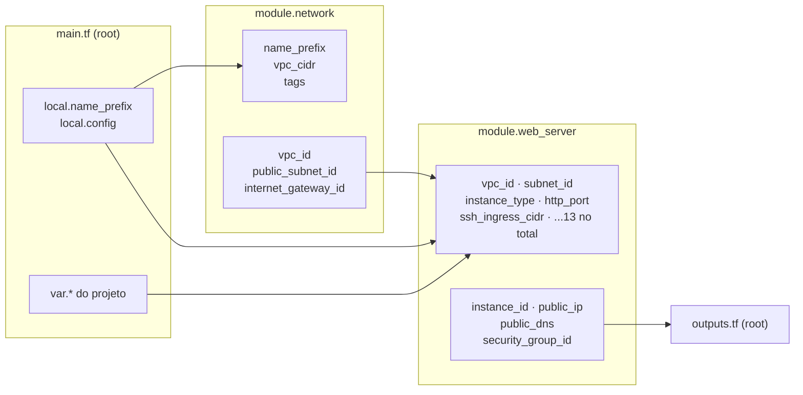
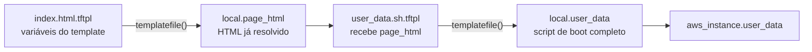
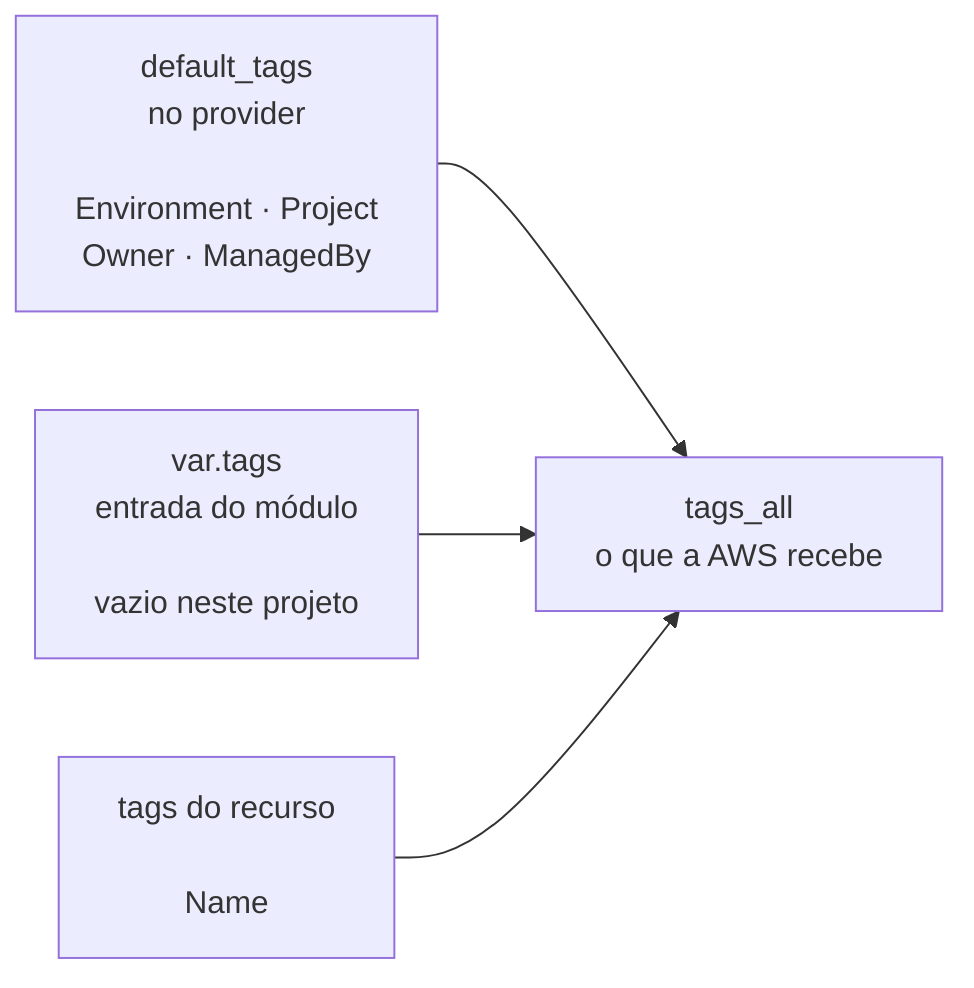
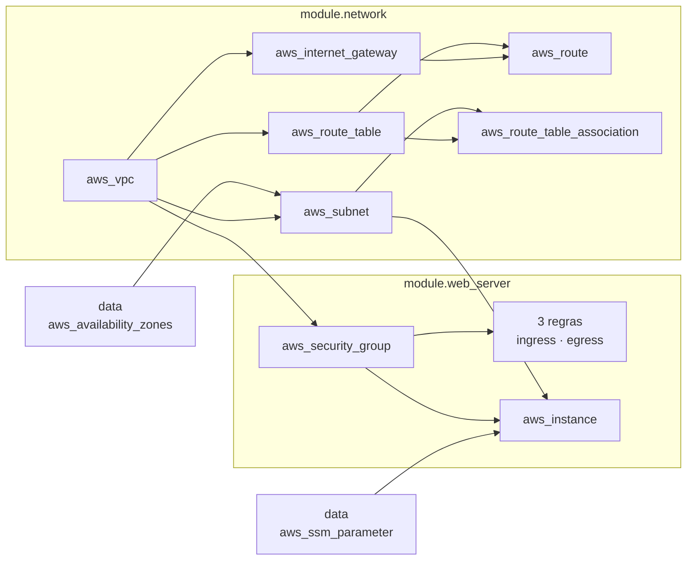

# CESAR School · Pós DevOps · Infraestrutura como Código

Atividade 1 da disciplina de Infraestrutura como Código (IaC) e Gerenciamento de
Configuração: provisionamento, na AWS, da infraestrutura mínima para hospedar uma
página web. Tudo escrito como código, com state remoto e dois ambientes.


---

## Sumário

- [O que é provisionado](#o-que-é-provisionado)
- [Como o Terraform funciona](#como-o-terraform-funciona)
- [Pré-requisitos](#pré-requisitos)
- [Preparando o backend remoto](#preparando-o-backend-remoto)
- [Estrutura do repositório](#estrutura-do-repositório)
- [Anatomia dos arquivos `.tf`](#anatomia-dos-arquivos-tf)
- [Variáveis](#variáveis)
- [Como executar](#como-executar)
- [Verificação](#verificação)
- [Limpeza dos recursos](#limpeza-dos-recursos)
- [Evidências da entrega](#evidências-da-entrega)
- [Troubleshooting](#troubleshooting)
- [Decisões de arquitetura](#decisões-de-arquitetura)
- [Divergências em relação ao enunciado](#divergências-em-relação-ao-enunciado)
- [Créditos](#créditos)

---

## O que é provisionado

Uma VPC própria com uma subnet pública, saída para a internet e uma instância EC2
servindo uma página HTML via `httpd`. São **12 recursos** por ambiente.



| Recurso | Papel |
| --- | --- |
| ☁️ **VPC** | Espaço de endereçamento privado e isolado |
| 🟩 **Subnet** | Recorte do CIDR, preso a uma Availability Zone |
| 🚪 **Internet Gateway** | Dá à VPC a *capacidade* de falar com a internet |
| 🗺️ **Route Table** + **Route** | Decide que `0.0.0.0/0` sai pelo IGW |
| 🔗 **Route Table Association** | Liga a tabela à subnet (é isso que a torna pública) |
| 🛡️ **Security Group** + 3 regras | Firewall da instância: SSH restrito, HTTP aberto, egress liberado |
| 🖥️ **EC2** | Servidor web, com IMDSv2 e volume criptografado |
| 🚦 **terraform_data** | Guard que impede `apply` fora dos workspaces `dev`/`prod` |

> [!NOTE]
> **Na AWS, "subnet pública" não é um tipo de subnet.** Ela é pública porque a
> route table associada a ela tem uma rota `0.0.0.0/0` apontando para um Internet
> Gateway. Omitir a `aws_route_table_association` faz o `apply` terminar com
> sucesso e todos os recursos existirem, sem nada responder.

**Referências oficiais:**

- [VPC e subnets][vpc-docs]
- [Route tables][rt-docs]
- [Security groups][sg-docs]

[vpc-docs]: https://docs.aws.amazon.com/vpc/latest/userguide/configure-subnets.html
[rt-docs]: https://docs.aws.amazon.com/vpc/latest/userguide/VPC_Route_Tables.html
[sg-docs]: https://docs.aws.amazon.com/vpc/latest/userguide/vpc-security-groups.html

---

## Como o Terraform funciona

O Terraform é **declarativo**: descrevemos o *estado desejado* em arquivos `.tf`.
Ele compara esse desejo com o **state** (o registro do que já foi criado) e
calcula o conjunto mínimo de mudanças para convergir os dois.



| Comando | O que faz |
| --- | --- |
| `terraform init` | Baixa providers e conecta no backend. Obrigatório após mexer em `module` ou `backend` |
| `terraform validate` | Checa sintaxe e tipos **sem** acessar a AWS |
| `terraform fmt` | Formata `.tf` e `.tfvars` no padrão canônico |
| `terraform plan` | Mostra o diff entre código, state e realidade |
| `terraform apply` | Executa o diff |
| `terraform destroy` | Remove tudo que está no state do workspace atual |

> [!IMPORTANT]
> **Por que o state é remoto.** O `terraform.tfstate` local não é compartilhável,
> morre junto com a máquina e guarda dados sensíveis em texto plano no diretório de
> trabalho. O S3 resolve durabilidade e compartilhamento; o **lock** resolve
> concorrência, porque dois `apply` simultâneos sobre o mesmo state corrompem a infra.

Este projeto usa `use_lockfile = true`, o lock **nativo do S3** disponível a partir
do Terraform 1.10. Ele cria um objeto `.tflock` ao lado do state durante a operação.
A tabela DynamoDB que material mais antigo pede **não é mais necessária**.

**Referências oficiais:**

- [Backend S3 e state locking][backend-s3]
- [Workspaces][workspaces-docs]
- [Módulos][modules-docs]

[backend-s3]: https://developer.hashicorp.com/terraform/language/backend/s3
[workspaces-docs]: https://developer.hashicorp.com/terraform/language/state/workspaces
[modules-docs]: https://developer.hashicorp.com/terraform/language/modules

---

## Pré-requisitos

Ferramentas que precisam estar instaladas na máquina:

- [Terraform](https://developer.hashicorp.com/terraform/install) **≥ 1.10**. A
  versão mínima não é arbitrária: é onde o `use_lockfile` do backend S3 passou a
  existir. Confira com `terraform version`.
- [AWS CLI v2](https://docs.aws.amazon.com/cli/latest/userguide/getting-started-install.html)
  (usado para criar o bucket do backend e para as verificações). Confira com
  `aws --version`.

Credenciais AWS configuradas em `~/.aws/credentials`. Se estiver usando o
**AWS Academy Learner Lab**, o bloco vem em *AWS Details → AWS CLI* e traz
**três** chaves: `aws_access_key_id`, `aws_secret_access_key` e
`aws_session_token`. O último é o mais esquecido.

Defina também a região padrão, senão comandos `aws` sem `--region` falham com
`NoRegion`:

```bash
aws configure set region us-east-1

# Valide o acesso:
aws sts get-caller-identity
```

> [!WARNING]
> **Nenhuma credencial vai para arquivo `.tf`.** O provider AWS procura sozinho,
> nesta ordem: variáveis de ambiente, `~/.aws/credentials` e metadata da instância.
> Ele foi desenhado justamente para que segredo nunca precise ser escrito em código.

---

## Preparando o backend remoto

O bucket é criado **manualmente, uma única vez, fora deste projeto**. O motivo é o
problema do ovo e da galinha: o Terraform precisa do bucket para guardar o state
*antes* de criar qualquer coisa. Se o projeto gerenciasse o próprio bucket, o
`destroy` apagaria a casa onde o state mora.

**Bucket utilizado nesta entrega:** `tfstate-pos-devops-iac-weynne-2026`

Para recriar o ambiente do zero, escolha um nome próprio (nomes de bucket são
únicos na AWS inteira):

```bash
BUCKET=tfstate-pos-devops-iac-<SEU-NOME>

# 1) Criar o bucket (us-east-1 é a única região que NÃO aceita
#    --create-bucket-configuration):
aws s3api create-bucket --bucket "$BUCKET" --region us-east-1

# 2) Versionamento: permite recuperar um state corrompido:
aws s3api put-bucket-versioning --bucket "$BUCKET" \
  --versioning-configuration Status=Enabled

# 3) O state guarda dados sensíveis em texto plano; bloqueie acesso público:
aws s3api put-public-access-block --bucket "$BUCKET" \
  --public-access-block-configuration "BlockPublicAcls=true,IgnorePublicAcls=true,BlockPublicPolicy=true,RestrictPublicBuckets=true"

# 4) E cifre em repouso:
aws s3api put-bucket-encryption --bucket "$BUCKET" \
  --server-side-encryption-configuration \
  '{"Rules":[{"ApplyServerSideEncryptionByDefault":{"SSEAlgorithm":"AES256"},"BucketKeyEnabled":true}]}'
```

Depois, ajuste o `bucket` em [`backend.tf`](backend.tf).

> [!NOTE]
> O bloco `backend` **não aceita variáveis nem interpolação**, só literais.
> O backend é lido antes de qualquer variável existir, porque é ele que
> diz onde está o state que define as variáveis.

---

## Estrutura do repositório

```
.
├── backend.tf                  # backend "s3" (bucket, key, lock)
├── versions.tf                 # required_version + required_providers
├── providers.tf                # provider "aws" + default_tags
├── locals.tf                   # configuração por workspace
├── variables.tf                # entradas do projeto
├── main.tf                     # guard de workspace + composição dos módulos
├── outputs.tf                  # IP, DNS, URL, workspace, tipo de instância
├── terraform.tfvars.example    # molde para o terraform.tfvars local
├── evidencias/                 # saídas de apply/destroy e prints
└── modules/
    ├── network/                # VPC, subnet, IGW, route table, association
    │   ├── main.tf
    │   ├── variables.tf
    │   ├── outputs.tf
    │   └── versions.tf
    └── web-server/             # Security Group, regras, EC2
        ├── main.tf
        ├── variables.tf
        ├── outputs.tf
        ├── versions.tf
        └── templates/
            ├── index.html.tftpl    # a página publicada
            └── user_data.sh.tftpl  # script de boot
```

Regras que separam o módulo raiz dos módulos filhos. O Terraform **não** impede
que sejam violadas:

- Módulo tem `versions.tf` com `required_providers`, declarando *do que precisa*.
- Módulo **nunca** tem bloco `provider`; ele herda do root. Provider dentro de
  módulo quebra o `destroy` e impede a remoção do módulo depois.
- Módulo **nunca** tem bloco `backend`.

---

## Anatomia dos arquivos `.tf`

A seção anterior mostra **onde** cada arquivo fica. Esta mostra **o que cada bloco
faz** e como escrevê-lo. Fechamos com o ponto que mais confunde quem vem de shell
script: **em que ordem o Terraform realmente avalia as coisas**.

### A ordem dos arquivos não existe

O Terraform lê **todos** os `.tf` do diretório, junta tudo em uma única
configuração e só então monta um grafo de dependências. Ele não executa arquivo
por arquivo, de cima para baixo.

Consequências práticas:

- Os nomes `main.tf`, `variables.tf`, `outputs.tf` são **convenção para humanos**.
  Este projeto inteiro funcionaria idêntico dentro de um único `main.tf`, só que
  ilegível.
- Um `local` definido em `locals.tf` pode ser usado em `main.tf` sem nenhuma
  declaração de import. Não existe import.
- Renomear um arquivo `.tf` **não** gera mudança no `plan`. Mover um `resource`
  de arquivo também não. O endereço dele no state é `tipo.nome`, não o caminho.

O que **de fato** define a ordem é a **referência**: quando `module.web_server`
lê `module.network.vpc_id`, o Terraform infere que a rede vem primeiro. Por isso
este projeto não usa `depends_on` em lugar nenhum.

### Ordem real de avaliação



Duas notas sobre esse fluxo:

1. O bloco `terraform` é lido **no `init`**, antes de qualquer variável existir.
   É a razão técnica de o `backend` não aceitar interpolação.
2. Dentro da etapa 5 não há ordem fixa entre `data` e `resource`. Um `data` cuja
   configuração já é conhecida é resolvido durante o `plan`; um que dependa de
   valor ainda desconhecido só é lido no `apply`.

### Os blocos usados neste projeto

| Bloco | Onde | Papel | Pode referenciar |
| --- | --- | --- | --- |
| `terraform` | `versions.tf`, `backend.tf` | Versões e onde mora o state | nada (só literais) |
| `provider` | `providers.tf` | Como falar com a AWS | `var`, `local`, `terraform.workspace` |
| `variable` | `variables.tf` | Entrada do usuário | nada (exceto `var.*` na `validation`) |
| `locals` | `locals.tf` | Valor derivado | `var`, outros `local`, `terraform.workspace` |
| `resource` | `main.tf`, módulos | Cria algo na AWS | tudo |
| `data` | módulos | Lê algo que já existe | tudo |
| `module` | `main.tf` | Compõe um conjunto de recursos | tudo |
| `output` | `outputs.tf` | Devolve valor ao chamador | tudo |

### Arquivo por arquivo: a raiz

<details>
<summary><b>1. <code>versions.tf</code></b>: o contrato de versões</summary>

Declara **do que o projeto precisa** para funcionar, sem configurar nada.

```hcl
terraform {
  required_version = ">= 1.10.0"

  required_providers {
    aws = {
      source  = "hashicorp/aws"
      version = "~> 6.0"
    }
  }
}
```

| Argumento | O que faz |
| --- | --- |
| `required_version` | Versão da CLI. Aqui `>= 1.10.0` porque `use_lockfile` só existe a partir dela |
| `required_providers` | Mapa de providers. `source` é o endereço no registry; `version` é a restrição |

O operador `~>` é o *pessimistic constraint*: `~> 6.0` aceita `6.1`, `6.58`, mas
**nunca** `7.0`. Traduz "confio em correções e novidades compatíveis, não confio
em uma quebra de contrato".

> **Nota:** não existe bloco `provider` aqui. **Declarar do que se precisa** e
> **configurar como usar** são coisas separadas. Por isso módulos filhos têm
> `versions.tf` mas nunca têm `provider`.

</details>

<details>
<summary><b>2. <code>backend.tf</code></b>: onde o state mora</summary>

Segundo bloco `terraform` do projeto. **Blocos `terraform` de arquivos
diferentes são mesclados**: é o mesmo bloco, escrito em dois lugares porque mudam
por motivos diferentes. O backend muda ao trocar de bucket ou de conta; as
versões mudam uma vez por ano.

```hcl
terraform {
  backend "s3" {
    bucket       = "tfstate-pos-devops-iac-weynne-2026"
    key          = "atividade1/terraform.tfstate"
    region       = "us-east-1"
    encrypt      = true
    use_lockfile = true
  }
}
```

> **Atenção, nenhuma variável nem interpolação:** o backend é lido no `init`,
> antes de o Terraform sequer saber que variáveis existem. Tudo aqui é literal,
> inclusive o nome do bucket. Tentar `bucket = var.bucket_name` falha com
> `Variables not allowed`.

O `key` é o caminho **do workspace `default`**. Os outros ganham um prefixo
automático, que isola `dev` de `prod` no mesmo bucket:

```text
atividade1/terraform.tfstate              ← workspace default
env:/dev/atividade1/terraform.tfstate     ← workspace dev
env:/prod/atividade1/terraform.tfstate    ← workspace prod
```

</details>

<details>
<summary><b>3. <code>providers.tf</code></b>: como falar com a AWS</summary>

Configura o provider que o `versions.tf` declarou.

```hcl
provider "aws" {
  region = var.aws_region

  default_tags {
    tags = {
      Environment = terraform.workspace
      Project     = var.project_name
      Owner       = var.owner
      ManagedBy   = "Terraform"
    }
  }
}
```

Aqui **já dá** para usar `var.*`. Variáveis são resolvidas antes dos providers.

O `default_tags` é o mecanismo oficial da AWS para tagging organizacional: aplica
as quatro chaves a **todo recurso taggeável**, inclusive os criados dentro dos
módulos, sem repetir uma linha. `Name` fica de fora de propósito. Ele muda por
recurso e é montado dentro do módulo.

> **Importante, nenhuma credencial aqui:** o provider as resolve sozinho, nesta
> ordem: variáveis de ambiente → `~/.aws/credentials` → metadata da instância.
> Credencial em `.tf` vai para o histórico do Git e não sai mais.

</details>

<details>
<summary><b>4. <code>variables.tf</code></b>: a superfície de entrada</summary>

Cada `variable` é um parâmetro do projeto. Anatomia completa:

```hcl
variable "ssh_ingress_cidr" {
  description = "Public IP allowed on port 22, in /32 CIDR form"
  type        = string
  # sem default = obrigatória

  validation {
    condition     = can(cidrhost(var.ssh_ingress_cidr, 0)) && endswith(var.ssh_ingress_cidr, "/32")
    error_message = "Must be a valid /32 CIDR, e.g. 203.0.113.42/32."
  }
}
```

| Argumento | Regra adotada |
| --- | --- |
| `description` | **Obrigatória** pelo Style Guide, em todas |
| `type` | **Sempre explícito**: `string`, `number`, `bool`, `list(string)`, `map(string)` |
| `default` | Ausente = variável obrigatória. Presente = resposta certa independente de quem executa |
| `validation` | Falha **antes** do plan, com mensagem própria em vez de erro da API da AWS |

O critério que decide se algo vira variável: **"isso muda de execução para
execução?"** Se sim, variável. Se não, `local`. E se muda mas existe uma resposta
correta universal, variável **com** default.

> **Dica:** sem a `validation`, um CIDR errado só falha no meio do `apply`, com
> uma mensagem da AWS que não diz qual variável causou o problema.

</details>

<details>
<summary><b>5. <code>locals.tf</code></b>: o que é derivado, não informado</summary>

`local` é um valor calculado dentro da configuração. Diferente de `variable`, ele
**não pode ser sobrescrito** por `-var` nem por `terraform.tfvars`. Essa
imutabilidade o torna o lugar certo para a política de ambientes.

```hcl
locals {
  environment = terraform.workspace

  environment_config = {
    default = { instance_type = "t2.micro", vpc_cidr = "10.0.0.0/16" }
    dev     = { instance_type = "t2.micro", vpc_cidr = "10.10.0.0/16" }
    prod    = { instance_type = "t3.micro", vpc_cidr = "10.20.0.0/16" }
  }

  config      = local.environment_config[local.environment]
  name_prefix = "${var.project_name}-${local.environment}"
}
```

O mapa `environment_config` é o coração da variação por workspace: **um único
lugar** decide tudo que difere entre ambientes.

Repare no índice direto `local.environment_config[local.environment]` em vez de
`lookup(...)` com fallback. É deliberado: um workspace fora do mapa é sempre um
erro, e deve falhar alto em vez de silenciosamente virar `dev`. Foi exatamente o
bug de um `prd` digitado no lugar de `prod`.

</details>

<details>
<summary><b>6. <code>main.tf</code></b>: a composição</summary>

O ponto de entrada. Contém só o guard de workspace e a ligação entre os módulos.
Nenhum recurso da AWS é declarado aqui diretamente.

**Bloco `module`**, que instancia um conjunto de recursos:

```hcl
module "network" {
  source = "./modules/network"   # único argumento obrigatório

  name_prefix = local.name_prefix
  vpc_cidr    = local.config.vpc_cidr
}
```

**A dependência entre módulos é implícita.** Ao passar `module.network.vpc_id`
para o `web_server`, o Terraform lê a referência e deduz a ordem sozinho:

```hcl
module "web_server" {
  source = "./modules/web-server"

  vpc_id    = module.network.vpc_id          # ← cria a dependência
  subnet_id = module.network.public_subnet_id
  # ...
}
```

`depends_on` só faria falta se houvesse uma dependência **invisível ao código**.
Não é o caso, e usá-lo aqui seria ruído.

> **Nota:** o label do bloco é `snake_case` (`module "web_server"`) e o diretório
> é `kebab-case` (`./modules/web-server`). Não é inconsistência: é a convenção dos
> módulos oficiais da HashiCorp, com identificador HCL em snake e caminho em kebab.

**Bloco `resource` com `precondition`**, o guard que impede aplicar no workspace
`default`:

```hcl
resource "terraform_data" "workspace_guard" {
  lifecycle {
    precondition {
      condition     = contains(["dev", "prod"], terraform.workspace)
      error_message = "Refusing to run in workspace '${terraform.workspace}'. ..."
    }
  }
}
```

`terraform_data` é embutido no Terraform: não tem provider, não cria nada na
nuvem, não custa nada. A `precondition` é avaliada **no plan**, não no
`validate`. Por isso o guard bloqueia o apply sem quebrar o requisito de
`terraform validate` limpo.

</details>

<details>
<summary><b>7. <code>outputs.tf</code></b>: o que o projeto devolve</summary>

```hcl
output "instance_public_ip" {
  description = "Public IP address of the web server instance"
  value       = module.web_server.public_ip
}
```

`description` é obrigatória pelo Style Guide. O `value` é qualquer expressão,
inclusive composta, como o `web_url = "http://${module.web_server.public_ip}"`.

Outputs existem em dois níveis, e a diferença importa:

| Nível | Quem lê |
| --- | --- |
| Output de **módulo** (`modules/network/outputs.tf`) | O `main.tf` da raiz, via `module.network.vpc_id` |
| Output da **raiz** (`outputs.tf`) | Quem executa, no terminal, via `terraform output` |

Um valor do módulo que não vira `output` é **inacessível** de fora. Módulo não
tem estado público. É a mesma ideia de `private` em orientação a objetos.

Os outputs `workspace` e `instance_type` não são exigidos pelo enunciado; existem
para que **cada evidência de apply se autoidentifique**, dizendo em qual ambiente
rodou e com que tipo de instância.

</details>

### Arquivo por arquivo: os módulos

Um módulo é uma caixa preta. O root não enxerga os recursos lá dentro, só o que
entra pelas `variable` e o que sai pelos `output`. Esse contrato é a parte que
mais importa, porque define o que pode mudar sem quebrar quem chama.



Os quatro arquivos se repetem nos dois módulos, com papéis fixos:

| Arquivo | Papel dentro do módulo |
| --- | --- |
| `main.tf` | Os recursos. É a única parte que a AWS enxerga |
| `variables.tf` | O que o módulo aceita receber, com `validation` própria |
| `outputs.tf` | O que o módulo devolve. Nada além disso é acessível de fora |
| `versions.tf` | `required_providers`. Declara a dependência sem configurá-la |

Nenhum deles tem bloco `provider` nem `backend`, pelas razões da seção
[Estrutura do repositório](#estrutura-do-repositório).

<details>
<summary><b>8. <code>modules/network/</code></b>: VPC, subnet e saída para a internet</summary>

**Interface**

| Entrada | Tipo | Obrigatória |
| --- | --- | :---: |
| `name_prefix` | `string` | ✅ |
| `vpc_cidr` | `string` | ✅ |
| `tags` | `map(string)` | (default `{}`) |

| Saída | Para que serve |
| --- | --- |
| `vpc_id` | Alimenta o Security Group do outro módulo |
| `public_subnet_id` | Alimenta a instância EC2 |
| `internet_gateway_id` | Não é consumido hoje. Existe porque um módulo de rede sem ele fica incompleto para reuso |

**A `validation` do `vpc_cidr`** é a mais interessante do projeto, e vai além de
checar se o CIDR é válido:

```hcl
condition = can(cidrnetmask(var.vpc_cidr)) && tonumber(split("/", var.vpc_cidr)[1]) <= 24
```

O segundo termo existe por uma razão concreta. O `main.tf` deriva a subnet com
`cidrsubnet(cidr, 8, 0)`, que soma 8 bits ao prefixo. Um `/25` viraria `/33`, e
mesmo um `/21` produziria uma subnet menor que o `/28` mínimo que a AWS aceita.
Sem esse teto, o erro só apareceria no meio do `apply`, vindo da API da AWS.

**Os cinco recursos e o data source** estão descritos na tabela da seção
[O que é provisionado](#o-que-é-provisionado). O que o código acrescenta são três
linhas que não têm sintoma de erro, apenas silêncio:

| Linha | O que acontece se faltar |
| --- | --- |
| `enable_dns_hostnames = true` | `public_dns` volta vazio. Nenhum erro |
| `map_public_ip_on_launch = true` | A instância sobe sem IP público. Nenhum erro |
| `aws_route_table_association` | Tudo existe, nada responde. Nenhum erro |

O `data "aws_availability_zones"` filtra por `opt-in-status = opt-in-not-required`.
Sem o filtro, a lista poderia trazer uma AZ que exige habilitação prévia na conta,
e a subnet falharia ao ser criada.

</details>

<details>
<summary><b>9. <code>modules/web-server/</code></b>: firewall, instância e a página</summary>

**Interface**

Treze entradas, agrupadas por finalidade:

| Grupo | Variáveis |
| --- | --- |
| Ligação com a rede | `vpc_id`, `subnet_id` |
| Dimensionamento | `instance_type`, `name_prefix` |
| Acesso | `http_port`, `ssh_ingress_cidr`, `key_name` |
| Conteúdo da página | `student_name`, `class_name`, `course_name`, `professor_name`, `page_title`, `page_subtitle`, `stack_items`, `environment` |
| Origem da imagem | `ami_parameter_name` |

| Saída | Para que serve |
| --- | --- |
| `public_ip` | Vira `instance_public_ip` e `web_url` no root |
| `public_dns` | Vira `instance_public_dns`, exigido pelo enunciado |
| `instance_id`, `security_group_id` | Para inspeção via CLI e `terraform state show` |

O `ami_parameter_name` merece atenção. O path do SSM poderia estar fixo no
`main.tf`, mas como variável o módulo passa a servir para qualquer distribuição
publicada pela AWS, bastando trocar o parâmetro na chamada.

**A renderização em dois estágios** acontece num bloco `locals` dentro do módulo,
e é o que mantém o HTML fora do código Terraform:



O `${path.module}` nas duas chamadas resolve o caminho relativo ao módulo, não a
quem o chama. Com um caminho relativo comum, mover o módulo quebraria a leitura
dos templates.

**As regras do Security Group são três recursos separados**, não blocos `ingress`
dentro do grupo. O motivo está em
[Decisões de arquitetura](#decisões-de-arquitetura). Uma pegadinha da API vale o
registro: no egress liberado, `ip_protocol = "-1"` exige que `from_port` e
`to_port` sejam **omitidos**. Informar `-1` neles causa erro.

**A instância** usa `data.aws_ssm_parameter.ami.insecure_value` como AMI, com
`user_data_replace_on_change = true`, `metadata_options` com IMDSv2 e volume raiz
`gp3` criptografado. Cada uma dessas escolhas está justificada em
[Decisões de arquitetura](#decisões-de-arquitetura).

</details>

### Precedência: as três que importam

#### 1. Valor de uma variável: o último a falar vence

Se a mesma variável for definida em vários lugares, o Terraform aplica esta
ordem, de **menor** para **maior** precedência:

| # | Origem | Exemplo |
| :---: | --- | --- |
| 1 | `default` no bloco `variable` | `default = "us-east-1"` |
| 2 | Variável de ambiente `TF_VAR_*` | `export TF_VAR_owner=weynne` |
| 3 | `terraform.tfvars` | `owner = "weynne"` |
| 4 | `terraform.tfvars.json` | (não usado aqui) |
| 5 | `*.auto.tfvars` (ordem alfabética do nome) | `prod.auto.tfvars` |
| 6 | `-var` e `-var-file` na linha de comando | `terraform apply -var="owner=ana"` |

Neste projeto só os níveis **1** e **3** são usados: default versionado para o que
descreve o projeto, `terraform.tfvars` para o que descreve a execução.

> [!WARNING]
> O nível 6 vence tudo, inclusive um `terraform.tfvars` correto. É a causa clássica
> do "mas eu configurei isso!" quando alguém deixou um `-var` num alias de shell.

#### 2. Tags: três camadas até o `tags_all`



O que aparece no `plan` é `tags` (o que está escrito no recurso) **e** `tags_all`
(o resultado final). Em caso de chave repetida, **a tag do recurso vence** a do
`default_tags`.

Isso explica uma armadilha de avaliação: as tags organizacionais **não aparecem
escritas no código dos módulos**. Quem procurar por `grep Environment modules/`
não acha nada. Por isso a evidência `tags-plan.txt` existe.

#### 3. Ordem de criação: o grafo, não o arquivo

O Terraform monta um DAG a partir das referências e cria em paralelo tudo que não
depende de nada. A cadeia deste projeto:



Duas leituras que esse desenho torna óbvias:

- **`aws_route` não é pré-requisito da association.** Ela depende de
  `aws_route_table` e de `aws_subnet`. A rota e a associação são ramos
  **paralelos**, criados ao mesmo tempo. Quem assume uma cadeia linear
  `route_table → route → association` desenha errado.
- **A seta `aws_vpc → aws_security_group` cruza a fronteira dos módulos.** Ela só
  existe porque `main.tf` passa `module.network.vpc_id` para o `web_server`. Essa
  linha ordena os dois módulos.

No `destroy` o grafo é percorrido **ao contrário**, o que garante que a instância
morre antes da subnet, e a subnet antes da VPC.

Para gerar o grafo real do projeto:

```bash
# graphviz não vem instalado por padrão:
sudo apt install graphviz

terraform workspace select dev   # o comando lê o state do workspace atual
terraform graph | dot -Tsvg > grafo.svg
```

---

## Variáveis

Apenas **duas** precisam ser preenchidas. Todo o resto tem default versionado:

| Variável | Obrigatória | Descrição |
| --- | :---: | --- |
| `owner` | ✅ | Responsável pelos recursos; vai para a tag `Owner` de tudo |
| `ssh_ingress_cidr` | ✅ | IP público em `/32`, o único autorizado na porta 22 |
| `key_name` | - | Par de chaves para SSH. `null` por padrão; no Learner Lab, `vockey` |
| `aws_region` | - | `us-east-1` |
| `project_name` | - | `atividade1-pos-devops-iac`, prefixo dos nomes e tag `Project` |
| `http_port` | - | `80` |
| `student_name`, `class_name` | - | Exibidos na página |
| `course_name`, `professor_name` | - | Exibidos na página |
| `page_title`, `page_subtitle` | - | Título da página |
| `stack_items` | - | Componentes listados no rodapé da página |

```bash
cp terraform.tfvars.example terraform.tfvars

# Descobrir o IP público (IP residencial muda; reconfirme antes de cada apply):
echo $(curl -s https://checkip.amazonaws.com)/32
```

`instance_type` e `vpc_cidr` **não são configuráveis** por variável: eles variam
por workspace e são definidos em [`locals.tf`](locals.tf).

> [!WARNING]
> `terraform.tfvars` **não é versionado**, porque guarda identificação pessoal e o
> IP público de quem executa. A fronteira entre `variables.tf` e `terraform.tfvars` não é
> "público vs. privado", é **"descreve o projeto" vs. "descreve a execução"**.

---

## Como executar

O projeto usa **workspaces** para manter dois ambientes a partir do mesmo código,
com states isolados no mesmo bucket:

| Workspace | `instance_type` | `vpc_cidr` |
| --- | --- | --- |
| `dev` | `t2.micro` | `10.10.0.0/16` |
| `prod` | `t3.micro` | `10.20.0.0/16` |

> [!IMPORTANT]
> **Rodando em outra conta AWS?** O `backend.tf` aponta para o bucket usado nesta
> entrega, que não é acessível de fora. Crie um bucket próprio (seção anterior) e
> aponte o backend para ele, sem editar arquivo nenhum:
>
> ```bash
> terraform init -backend-config="bucket=SEU-BUCKET"
> ```
>
> O bloco `backend` não aceita variáveis, mas aceita sobrescrita por
> `-backend-config`. É assim que se parametriza um backend sem tocar no código.

```bash
# 1) Checar a formatação (não precisa de credencial nem de init):
terraform fmt -check -recursive

# 2) Instalar os módulos e providers SEM conectar no backend, e validar.
#    validate exige os módulos instalados, por isso o init vem antes.
#    O -backend=false permite validar mesmo sem acesso à AWS:
terraform init -backend=false
terraform validate

# 3) Init de verdade, conectando no backend S3:
rm -rf .terraform
terraform init          # ou: terraform init -backend-config="bucket=SEU-BUCKET"

# 4) Preencher as duas variáveis obrigatórias:
cp terraform.tfvars.example terraform.tfvars
echo $(curl -s https://checkip.amazonaws.com)/32    # valor do ssh_ingress_cidr

# 5) Criar e selecionar o ambiente de desenvolvimento.
#    -or-create é idempotente: cria se não existir, seleciona se existir.
#    (terraform workspace new falha com "already exists" na segunda vez)
terraform workspace select -or-create dev
terraform workspace show      # confirme SEMPRE antes de aplicar

# 6) Revisar o plano e aplicar:
terraform plan                # espere: Plan: 12 to add
terraform apply

# 7) Repetir para produção:
terraform workspace select -or-create prod
terraform workspace show
terraform apply
```

> [!IMPORTANT]
> **O workspace `default` está bloqueado.** Ele não é um ambiente, e sim o
> workspace que o Terraform cria sozinho. Um `terraform_data` com `precondition` recusa o
> `plan`/`apply` ali com uma mensagem explícita, sem quebrar o `terraform validate`,
> que continua limpo. Aplicar no `default` criaria uma terceira VPC indesejada.

O `user_data` leva **de 60 a 90 segundos após o `Apply complete!`** para instalar
e subir o `httpd`. `Connection refused` logo de cara é esperado.

```bash
terraform output web_url    # URL pronta para abrir no navegador
```

---

## Verificação

```bash
# Ver todos os outputs do ambiente atual:
terraform output

# Provar o isolamento de state entre workspaces (cada um em seu próprio caminho):
aws s3 ls s3://tfstate-pos-devops-iac-weynne-2026 --recursive

# Conferir as tags efetivamente aplicadas (tags_all inclui as default_tags):
terraform state show 'module.web_server.aws_instance.this' | grep -A6 tags_all

# Testar a página pela linha de comando:
curl -s $(terraform output -raw web_url) | grep -E '<h1>|Aluno|Ambiente'
```

O `aws s3 ls` deve mostrar dois caminhos distintos:

```
atividade1/terraform.tfstate              ← workspace default
env:/dev/atividade1/terraform.tfstate     ← workspace dev
env:/prod/atividade1/terraform.tfstate    ← workspace prod
```

Com `key_name` configurado, dá para entrar na instância:

```bash
ssh -i ~/.ssh/labuser.pem ec2-user@$(terraform output -raw instance_public_ip)

# O log do cloud-init mostra cada comando do user_data (graças ao set -x):
sudo cat /var/log/cloud-init-output.log
```

---

## Limpeza dos recursos

O `destroy` afeta **apenas o workspace selecionado**. É preciso rodar em cada um:

```bash
terraform workspace select dev
terraform workspace show
terraform destroy

terraform workspace select prod
terraform workspace show
terraform destroy
```

Confirme no console que não sobrou nenhuma instância:

```bash
aws ec2 describe-instances --region us-east-1 \
  --filters "Name=instance-state-name,Values=running,pending,stopped" \
  --query 'Reservations[].Instances[].[InstanceId,InstanceType,State.Name]' --output text
```

O bucket do backend **não** é destruído, porque pertence a outro ciclo de vida e
guarda o histórico do state.

---

## Evidências da entrega

Todas na pasta [`evidencias/`](evidencias/):

| Arquivo | Conteúdo |
| --- | --- |
| `apply-dev.txt` | Saída completa do `apply` no workspace `dev`, com `Apply complete!` |
| `apply-prod.txt` | Idem para `prod` |
| `destroy-dev.txt` | Saída completa do `destroy` em `dev`, com `Destroy complete!` |
| `destroy-prod.txt` | Idem para `prod` |
| `navegador-dev.png` | Página aberta pelo IP público, ambiente `dev` |
| `navegador-prod.png` | Idem para `prod` |
| `tags-plan.txt` | Trecho do `plan` mostrando o `tags_all` aplicado |
| `s3-workspaces.txt` | `aws s3 ls` provando os states isolados por workspace |

Os ambientes usados para gerar as evidências foram **`dev` e `prod`**. Cada saída
de `apply` inclui os outputs `workspace` e `instance_type`, o que torna cada
evidência autoidentificável.

O `tags-plan.txt` existe por um motivo específico: as tags organizacionais vêm do
`default_tags` no provider, então **não aparecem escritas no código dos módulos**.
O `tags_all` do plano é a prova de que elas são efetivamente aplicadas.

---

## Troubleshooting

- 🔴 **`explicit deny in ... voc-cancel-cred` em qualquer comando AWS:**
  - **Causa:** a sessão do AWS Academy Learner Lab está encerrada. O token ainda
    autentica (`sts get-caller-identity` responde), mas toda ação é negada.
  - **Solução:** reinicie o lab e cole as credenciais novas. Não é erro de código.

- 🔴 **`ExpiredToken` no meio de um `apply`:**
  - **Causa:** a sessão do lab expirou (dura de 3 a 4 horas).
  - **Solução:** renove as credenciais e rode o `apply` de novo. O state remoto
    preservou o que já havia sido criado; ele continua de onde parou.

- 🟡 **A página não responde depois de 3 minutos:**
  - **1.** Output de IP público vazio? → problema de subnet / `map_public_ip_on_launch`.
  - **2.** Tem IP mas não responde? → route table association ou Security Group.
  - **3.** Responde com página errada? → `user_data`; entre por SSH e leia
    `/var/log/cloud-init-output.log`.

- 🟡 **Output `instance_public_dns` vazio:**
  - **Causa:** `enable_dns_hostnames` é `false` por padrão em VPC customizada.
  - **Solução:** está habilitado em [`modules/network/main.tf`](modules/network/main.tf).
    Se um dia sumir, o sintoma é este, sem nenhuma mensagem de erro.

- 🟡 **`Module not installed`:**
  - **Causa:** um bloco `module` foi criado ou alterado sem reinicializar.
  - **Solução:** `terraform init` novamente.

- 🟡 **`Unable to access object "atividade1/terraform.tfstate" ... 403 Forbidden`,
  logo depois de um `init` limpo:**
  - **Causa:** `rm -rf .terraform` apaga também o `.terraform/environment`, que guarda
    qual workspace está selecionado. O Terraform volta para o `default`, cujo state
    nunca foi criado. E como a policy do Learner Lab não permite distinguir "objeto
    inexistente" de "sem permissão", o S3 responde **403 em vez de 404**, o que faz
    o erro parecer problema de credencial.
  - **Solução:** `terraform workspace select dev`. As credenciais estão corretas.

- 🟡 **`Refusing to run in workspace 'default'`:**
  - **Causa:** comportamento esperado, é o guard funcionando.
  - **Solução:** `terraform workspace select dev` (ou `prod`).

- 🟡 **SSH não conecta:**
  - **Causa 1:** o IP público mudou; o `/32` do Security Group aponta para o antigo.
  - **Causa 2:** permissão do `.pem`. O OpenSSH recusa chave legível por outros
    usuários. Corrija com `chmod 400 ~/.ssh/sua-chave.pem`.

---

## Decisões de arquitetura

**Dois módulos, não um.** `network` e `web-server` têm ciclos de vida e razões de
mudança diferentes. A dependência entre eles é **implícita**. O root referencia
`module.network.vpc_id`, e o Terraform infere a ordem a partir da referência. Não há
`depends_on` no projeto; precisar dele costuma indicar que faltou uma referência real.

**CIDRs distintos por ambiente** (`10.10` em dev, `10.20` em prod). Não é exigido,
mas é a resposta certa: dois ambientes reais nunca compartilham bloco de endereços,
porque um dia precisarão se enxergar (peering, Transit Gateway) e CIDRs sobrepostos
tornam isso impossível.

**Regras de Security Group como recursos separados**
(`aws_vpc_security_group_ingress_rule`) em vez dos blocos `ingress`/`egress` inline.
É a recomendação atual do provider AWS: com blocos inline, alterar uma regra faz o
Terraform recriar **todas**. As regras separadas também aceitam tags próprias.

**`name_prefix` + `create_before_destroy` no Security Group.** Nome de SG é único
por VPC; com nome fixo, substituir o grupo falha porque o antigo ainda o detém.

**`default_tags` no provider** em vez de repetir tags em cada recurso. É o mecanismo
oficial da AWS para tagging organizacional, e alcança inclusive recursos criados
dentro de módulos. O `Name` fica de fora de propósito: ele difere por recurso e é
combinado via `merge()` dentro de cada módulo.

**IMDSv2 obrigatório** (`http_tokens = "required"`) e **volume raiz criptografado**.
O IMDSv1 permite roubo das credenciais da instância via SSRF e é sinalizado por
qualquer scanner de IaC.

**`user_data_replace_on_change = true`.** Sem isso, editar o `user_data` não recria
a instância: o Terraform reporta sucesso e a página antiga continua no ar.

**Página em `templatefile()`, não em heredoc.** O HTML vive em
`templates/index.html.tftpl` (um arquivo de verdade, editável sem escapes) e é
injetado no script de boot em dois estágios. O `${path.module}` mantém o caminho
relativo ao módulo, não a quem o chama.

**`key_name` opcional com `default = null`.** O valor `vockey` é específico do
Learner Lab e fica apenas no `terraform.tfvars` local. Assim o código permanece
executável em qualquer conta AWS: sem esse arquivo, a instância sobe sem par de
chaves em vez de falhar com `InvalidKeyPair.NotFound`.

**Sem subnet privada e sem HTTPS.** A carga é um servidor web que precisa ser
alcançável da internet. Ele *pertence* à subnet pública. Uma subnet privada exigiria
NAT Gateway (custo relevante) sem ganho de segurança neste cenário. E certificados TLS
são emitidos para nomes de domínio, não para IPs; como a atividade exige acesso pelo
IP público, um certificado autoassinado só produziria aviso de segurança no navegador.
Em produção, o desenho seria ALB em subnets públicas com certificado gerenciado pelo
ACM, instâncias em subnets privadas e duas ou mais AZs.

**Egress liberado para `0.0.0.0/0`.** O `user_data` precisa alcançar os repositórios
do Amazon Linux, cujos IPs não são fixos. Restringir de verdade exigiria VPC Endpoints.

**Uma AZ só.** Alta disponibilidade com uma única instância não existe. Redundância
de rede sem redundância de carga é ilusão de disponibilidade.

> [!NOTE]
> **Sobre o limite dos workspaces.** Eles são adequados para variações pequenas e
> previsíveis entre ambientes, como aqui. Para separação real, a recomendação da
> HashiCorp é **contas AWS separadas**: workspaces compartilham backend, credenciais
> e código, e um `select` errado aplica em produção achando que é desenvolvimento. O
> guard no `main.tf` mitiga parte desse risco, mas não o elimina.

---

## Divergências em relação ao enunciado

Dois pontos em que este projeto seguiu a recomendação oficial da AWS/HashiCorp em vez
da letra do enunciado. Ambos preservam o requisito de fundo.

**1. Chaves de tag em inglês.** O enunciado pede `Name`, `Curso` e `Ambiente`. O
projeto usa `Name`, `Environment`, `Project`, `Owner` e `ManagedBy`, seguindo a
convenção de tagging da AWS, com mapeamento direto: `Curso` → `Project`,
`Ambiente` → `Environment`. O requisito de fundo, rastreabilidade consistente de
ambiente e projeto em todos os recursos, está atendido; a evidência em
`evidencias/tags-plan.txt` comprova as tags efetivamente aplicadas.

**2. AMI via SSM Parameter Store.** O enunciado pede `data "aws_ami"`. O projeto usa
`data "aws_ssm_parameter"` no path público mantido pela AWS
(`/aws/service/ami-amazon-linux-latest/al2023-ami-kernel-default-x86_64`), que é a
fonte canônica da Amazon Linux 2023 e não depende de filtro por padrão de nome, que
quebraria se a AWS alterasse a convenção de nomenclatura das imagens. O requisito
real do enunciado, **nunca usar ID fixo**, está cumprido: a AMI é resolvida
dinamicamente a cada `plan`.

Detalhe de implementação: o atributo usado é `.insecure_value`, não `.value`. O
`.value` é marcado como `sensitive` mesmo em parâmetros públicos, o que ocultaria o
AMI ID justamente na saída do `plan` usada como evidência.

---

## Créditos

Disciplina de **Infraestrutura como Código (IaC) e Gerenciamento de Configuração**,
ministrada por **Cris Apolinário**, na especialização em DevOps da CESAR School.

Identidade visual da página publicada baseada na marca da
[CESAR School](https://www.cesar.school/).
