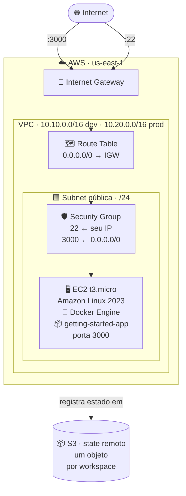
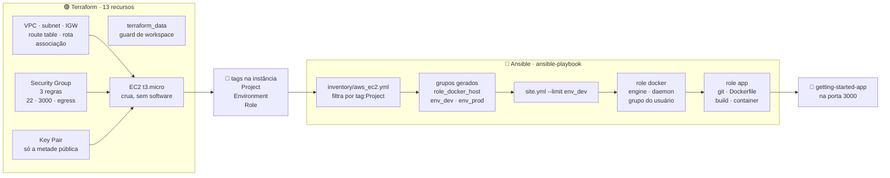
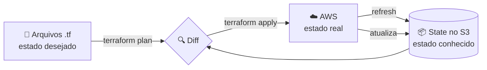
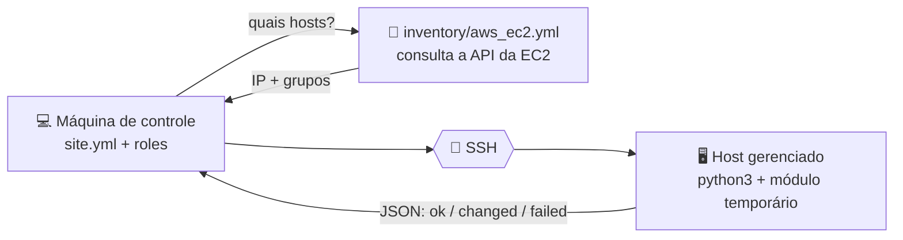

# CESAR School · Pós DevOps · Infraestrutura como Código

Este documento é o **Projeto Final** da disciplina de **Infraestrutura como
Código (IaC) e Gerenciamento de Configuração**: provisionamento e configuração
integrados, com Terraform entregando a infraestrutura e Ansible configurando o
que roda dentro dela.

O repositório guarda duas entregas avaliativas, cada uma em seu próprio
diretório, com código, evidências e state remoto separados.


## Entregas

| Entrega | Diretório | Documentação | O que provisiona |
| --- | --- | --- | --- |
| **Projeto Final** | [`projeto-final/`](projeto-final/) | **este documento** | VPC + EC2 pelo Terraform; Docker Engine e a aplicação `getting-started-app` pelo Ansible |
| **Atividade 1** | [`atividade-1/`](atividade-1/) | [`atividade-1/README.md`](atividade-1/README.md) | VPC + EC2 servindo uma página web, com backend S3 e workspaces |

A Atividade 1 tem documentação própria e completa no diretório dela. Aqui, a
seção [Da Atividade 1 ao Projeto Final](#da-atividade-1-ao-projeto-final)
registra o que foi reaproveitado, o que foi adaptado e o que nasceu nesta
entrega.

---

# Projeto Final — Terraform + Ansible

Provisionamento e configuração integrados, seguindo o fluxo
**Terraform provisiona → Ansible configura**. O Terraform entrega uma instância
EC2 crua; tudo que roda dentro dela — Docker Engine e o container da aplicação
[`getting-started-app`](https://github.com/docker/getting-started-app) — é
responsabilidade do Ansible.

- [Arquitetura](#arquitetura)
- [A integração Terraform → Ansible](#a-integração-terraform--ansible)
- [Pré-requisitos](#pré-requisitos-do-projeto-final)
- [Execução](#execução)
- [Destruição](#destruição)
- [Evidências](#evidências)
- [Estrutura de diretórios](#estrutura-de-diretórios-do-projeto-final)
- [Da Atividade 1 ao Projeto Final](#da-atividade-1-ao-projeto-final)
- [Decisões de arquitetura](#decisões-de-arquitetura-do-projeto-final)
- [Divergências em relação ao enunciado](#divergências-em-relação-ao-enunciado-projeto-final)
- [Troubleshooting](#troubleshooting-do-projeto-final)

> A explicação conceitual das duas ferramentas, com o passeio arquivo por
> arquivo, está em
> [Como as ferramentas funcionam](#como-as-ferramentas-funcionam).

---

## Arquitetura

São **13 recursos por workspace**: 12 na AWS e um `terraform_data` que atua
como guard de workspace.



E o fluxo entre as duas ferramentas:



O Terraform entrega **tudo que está em volta** da máquina e para na porta dela.
As tags são o único dado que atravessa a fronteira: o Ansible não lê o state,
não recebe arquivo gerado e não é chamado pelo Terraform — ele descobre a
instância perguntando à API da EC2 quais máquinas têm aquelas tags.

| Recurso | Papel |
| --- | --- |
| ☁️ **VPC** | Espaço de endereçamento isolado, um CIDR por workspace |
| 🟩 **Subnet pública** | Recorte `/24` derivado do CIDR via `cidrsubnet()` |
| 🚪 **Internet Gateway** | Dá à VPC a capacidade de falar com a internet |
| 🗺️ **Route Table** + **Route** + **Association** | É a associação que torna a subnet pública, não o nome dela |
| 🛡️ **Security Group** + 3 regras | SSH restrito ao `/32` do operador, 3000 aberta, egress liberado |
| 🔑 **Key Pair** | Registra a metade pública da chave que o Ansible usa para entrar |
| 🖥️ **EC2 t3.micro** | Host cru, com IMDSv2 obrigatório e volume raiz cifrado |
| 🚦 **terraform_data** | Guard que recusa `apply` fora dos workspaces `dev`/`prod` |

> [!NOTE]
> A instância sobe **sem nenhum software instalado**. Não há `user_data`, não
> há `provisioner`. Essa ausência é a decisão central da entrega: instalar
> software pelo Terraform mistura as responsabilidades das duas ferramentas
> exatamente como o `remote-exec` faria, só que de forma menos visível.

---

## A integração Terraform → Ansible

### Opção escolhida: **A — inventário dinâmico + execução manual**

O enunciado aceita duas formas. Esta entrega usa a **Opção A**: o Ansible
descobre a infraestrutura consultando a API da EC2 através do plugin
`amazon.aws.aws_ec2`, e o `ansible-playbook` é executado como um passo
próprio, depois do `terraform apply`.

Com as duas etapas independentes, reexecutar a configuração é uma operação de
primeira classe: basta rodar o playbook de novo, sem tocar no Terraform e sem
forçar a recriação de recurso nenhum. A segunda execução — a que comprova
`changed=0` — passa a ser um passo natural do fluxo, e não algo que precisa ser
provocado.

### O que dispara o quê, em que ordem

| # | Arquivo | O que faz | Produz |
| --- | --- | --- | --- |
| 1 | `terraform/main.tf` | Cria key pair, VPC e a instância | Uma EC2 com as tags `Project`, `Environment` e `Role` |
| 2 | `terraform/providers.tf` | `default_tags` aplica `Project` e `Environment` a **todo** recurso | As tags que o passo 3 vai filtrar |
| 3 | `ansible/inventory/aws_ec2.yml` | Consulta a EC2 e converte tags em grupos | `role_docker_host`, `env_dev`, `env_prod` |
| 4 | `ansible/ansible.cfg` | Aponta o inventário, o usuário e a chave privada | Conexão SSH sem flags na linha de comando |
| 5 | `ansible/site.yml` | Alvo `role_docker_host`, aplica as roles em ordem | — |
| 6 | `ansible/roles/docker` | Engine, daemon habilitado, usuário no grupo | Host pronto para os módulos `community.docker` |
| 7 | `ansible/roles/app` | Clona, renderiza o Dockerfile, builda e sobe o container | Aplicação em `:3000` |

Nada nesse encadeamento passa por arquivo escrito à mão: o único acoplamento
entre as duas ferramentas são **as tags**.

### A costura: uma tag dos dois lados

O ponto exato onde o Terraform encontra o Ansible:

```hcl
# terraform/providers.tf -- aplicado a todo recurso taggável
default_tags {
  tags = {
    Environment = terraform.workspace          # dev | prod
    Project     = var.project_name             # projeto-final-pos-devops-iac
  }
}
```
```hcl
# terraform/modules/docker-host/main.tf -- na instância
tags = merge(var.tags, {
  Role = "docker-host"
})
```
```yaml
# ansible/inventory/aws_ec2.yml
filters:
  tag:Project: projeto-final-pos-devops-iac    # tem que casar com var.project_name
  instance-state-name: running

keyed_groups:
  - key: tags.Role                             # docker-host -> role_docker_host
    prefix: role
  - key: tags.Environment                      # dev -> env_dev
    prefix: env

compose:
  ansible_host: public_ip_address              # sem isto, o plugin entrega o DNS privado
```

Trocar `var.project_name` de um lado sem trocar do outro faz o inventário
voltar vazio — e o Ansible **não falha** nesse caso, apenas termina com
`ok=0`, o que parece sucesso. É por isso que `ansible-inventory --graph` é um
passo obrigatório do roteiro de execução, e não um comando de depuração.

### Onde cada abordagem executa

| Abordagem | Onde roda | Implicação |
| --- | --- | --- |
| `remote-exec` | Dentro do servidor | Configuraria a instância no lugar do Ansible. Proibido pelo enunciado |
| `local-exec` | Na máquina do operador | Alternativa aceita pelo enunciado (Opção B). Roda como parte do `terraform apply`: a configuração deixa de ser um passo que se repete sozinho, e uma falha do Ansible marca o recurso do Terraform como problemático |
| **inventário dinâmico** | Etapas separadas | **Adotado nesta entrega.** Cada ferramenta roda por conta própria: reexecutar a configuração não exige tocar na infraestrutura, e uma falha do Ansible não marca recurso nenhum do Terraform |

> [!NOTE]
> **Idempotência não é privilégio da Opção A.** O Terraform é idempotente por
> construção, e o enunciado cobra `changed=0` do Ansible em qualquer uma das
> duas opções. A diferença está no custo de chegar lá: na Opção B, um segundo
> `terraform apply` não reexecuta o playbook — o `null_resource` não mudou,
> então o provisioner não dispara — e provar o `changed=0` do Ansible exigiria
> rodar o playbook à parte assim mesmo, ou forçar a recriação do recurso.

Não há **nenhum** bloco `provisioner` no código desta entrega:

```text
$ grep -rn 'provisioner\|remote-exec' projeto-final --include='*.tf'
projeto-final/terraform/modules/docker-host/main.tf:2:# installing software mixes the same responsibilities as provisioner
projeto-final/terraform/modules/docker-host/main.tf:3:# "remote-exec" -- everything inside the instance belongs to Ansible.
```

As duas únicas ocorrências estão num comentário explicando por que o padrão
não é usado.

#### O que acontece quando o Ansible falha dentro de um `local-exec`

O Terraform espera o **código de saída** do `ansible-playbook`. Zero, e o
`apply` segue; qualquer outro, e o `apply` termina com erro e marca o recurso
que carrega o provisioner como *tainted* — o próximo `apply` o destrói e recria.

O tamanho do estrago depende de onde o provisioner mora. Preso ao
`aws_instance`, um erro de playbook custa **recriar a máquina inteira**. Num
`null_resource` com `triggers`, como o enunciado sugere, recria apenas o
recurso lógico, que não existe na AWS e não custa nada — motivo pelo qual essa
é a montagem recomendada da Opção B.

Dá para contornar com `on_failure = continue`, que faz o Terraform registrar o
erro e seguir sem marcar nada:

```hcl
provisioner "local-exec" {
  command    = "ansible-playbook ..."
  on_failure = continue    # palavra nua, não string
}
```

Mas isso troca uma falha barulhenta por uma silenciosa: o `apply` termina
verde, o servidor fica sem configuração, e o problema reaparece mais tarde
como "a aplicação não responde". Num fluxo em que o Ansible é a única coisa que
instala software, é o pior negócio possível.

Nada disso se aplica à Opção A: o `ansible-playbook` é um comando próprio, e
uma falha dele não tem como marcar recurso nenhum do Terraform.

---

## Pré-requisitos do projeto final

| Ferramenta | Versão usada | Observação |
| --- | --- | --- |
| Terraform | ≥ 1.10 | `use_lockfile` no backend S3 exige 1.10+ |
| Ansible | core 2.21 | instalado via `pipx` |
| AWS CLI | v2 | credenciais válidas em `us-east-1` |
| `boto3` / `botocore` | — | **no mesmo ambiente do Ansible** |

As coleções e o `boto3` são a parte que costuma falhar em silêncio:

```bash
cd projeto-final/ansible
ansible-galaxy collection install -r requirements.yml

# Se o Ansible foi instalado por pipx, ele vive num venv isolado: um
# "pip install boto3" comum instala num Python que ele não enxerga, e o
# inventário dinâmico volta vazio sem explicar por quê.
pipx inject ansible boto3 botocore
```

Gere o par de chaves que o Terraform vai registrar (uma vez só):

```bash
ssh-keygen -t ed25519 -f ~/.ssh/projeto-final -N "" -C "projeto-final-iac"
```

### Você precisa do seu próprio bucket de state

O [`backend.tf`](projeto-final/terraform/backend.tf) aponta para o bucket desta
entrega, que **não é acessível de fora**. Nomes de bucket são únicos na AWS
inteira, então troque `SEU-NOME` por algo só seu:

```bash
export BUCKET="tfstate-projeto-final-SEU-NOME"

# 1) Criar o bucket (us-east-1 é a única região que NÃO aceita
#    --create-bucket-configuration):
aws s3api create-bucket --bucket "$BUCKET" --region us-east-1

# 2) Versionamento: permite recuperar um state corrompido:
aws s3api put-bucket-versioning --bucket "$BUCKET" \
  --versioning-configuration Status=Enabled

# 3) O state guarda dados sensíveis em texto plano; bloqueie acesso público:
aws s3api put-public-access-block --bucket "$BUCKET" \
  --public-access-block-configuration \
  "BlockPublicAcls=true,IgnorePublicAcls=true,BlockPublicPolicy=true,RestrictPublicBuckets=true"

# 4) E cifre em repouso:
aws s3api put-bucket-encryption --bucket "$BUCKET" \
  --server-side-encryption-configuration \
  '{"Rules":[{"ApplyServerSideEncryptionByDefault":{"SSEAlgorithm":"AES256"}}]}'
```

O `init` mais adiante recebe esse bucket por `-backend-config`, sem editar o
`backend.tf`.

### Você precisa recriar o vault

O [`vault.yml`](projeto-final/ansible/group_vars/all/vault.yml) está versionado
**cifrado** — é assim que o `ansible-vault` deve ser usado. Mas a senha que o
abre vive em `.vault_pass`, que está no `.gitignore` e não vem no clone. Sem
ela, qualquer `ansible-playbook` falha na decifragem.

Como o valor protegido é uma **senha de admin simulada**, que não dá acesso a
nada, recrie o cofre com a sua própria senha:

```bash
cd projeto-final/ansible

openssl rand -base64 32 > .vault_pass
chmod 600 .vault_pass

rm group_vars/all/vault.yml
ansible-vault create group_vars/all/vault.yml
```

No editor que abrir, uma linha:

```yaml
vault_app_admin_password: "qualquer-valor-ficticio"
```

Confirme que ficou cifrado — a primeira linha tem que ser o cabeçalho do vault:

```bash
head -1 group_vars/all/vault.yml     # $ANSIBLE_VAULT;1.1;AES256
```

---

## Execução

Os comandos abaixo são exatamente os que produziram as evidências.

> [!NOTE]
> Os `cd` marcados com `projeto-final/...` partem da **raiz do repositório**;
> os marcados com `../` são relativos ao passo anterior. Se estiver perdido,
> volte para a raiz com `cd "$(git rev-parse --show-toplevel)"`.
>
> O passo 2 usa a variável `$BUCKET` definida nos pré-requisitos. Num terminal
> novo, exporte-a de novo antes do `init`.

### 1. Variáveis locais

```bash
cd projeto-final/terraform

cat > terraform.tfvars <<EOF
owner            = "Seu Nome"
ssh_ingress_cidr = "$(curl -s https://checkip.amazonaws.com)/32"
EOF
```

`terraform.tfvars` está no `.gitignore`: ele guarda o IP de quem executa.
O IP residencial muda; reconfirme antes de cada `apply`.

### 2. Backend e workspace

```bash
terraform init -backend-config="bucket=$BUCKET"
terraform fmt -check -recursive
terraform validate
terraform workspace select -or-create dev
```

### 3. Provisionar

```bash
terraform apply
terraform output
```

Saída relevante:

```
app_url             = "http://<ip>:3000"
app_url_dns         = "http://<dns>:3000"
instance_public_ip  = "<ip>"
ssh_command         = "ssh -i ~/.ssh/projeto-final ec2-user@<ip>"
workspace           = "dev"
```

### 4. Conferir a descoberta antes de configurar

```bash
cd ../ansible
ansible-inventory --graph
```

```
@all:
  |--@ungrouped:
  |--@aws_ec2:
  |  |--projeto-final-pos-devops-iac-dev-host-instance
  |--@role_docker_host:
  |  |--projeto-final-pos-devops-iac-dev-host-instance
  |--@env_dev:
  |  |--projeto-final-pos-devops-iac-dev-host-instance
```

> [!IMPORTANT]
> Se os grupos vierem vazios, **pare aqui**. Rodar o playbook contra um
> inventário vazio termina em `ok=0 changed=0`, que se parece com sucesso.

### 5. Configurar

```bash
ansible-playbook site.yml --limit env_dev
```

```
PLAY RECAP ***********************************************************
...dev-host-instance : ok=9  changed=8  unreachable=0  failed=0
```

### 6. Provar a idempotência

Sem alterar nada — nem código, nem infraestrutura:

```bash
ansible-playbook site.yml --limit env_dev
```

```
PLAY RECAP ***********************************************************
...dev-host-instance : ok=9  changed=0  unreachable=0  failed=0
```

### 7. Acessar

```bash
cd ../terraform
curl -si "$(terraform output -raw app_url)" | head -5

# O echo acrescenta a quebra de linha que o -raw omite, deixando a URL
# clicável no terminal. Sem ele o zsh imprime um "%" no fim, que o
# detector de links captura junto e invalida o endereço.
echo "$(terraform output -raw app_url)"        # pelo IP
echo "$(terraform output -raw app_url_dns)"    # pelo DNS público
```

Para abrir direto do WSL, sem clicar:

```bash
explorer.exe "$(terraform output -raw app_url)"
```

Ambas as URLs carregam a porta explicitamente. O Security Group abre apenas
22 e 3000, então um hostname sem porta cai na 80 e resulta em timeout.

### 8. Repetir em `prod`

```bash
terraform workspace select -or-create prod
terraform apply
cd ../ansible && ansible-playbook site.yml --limit env_prod
```

Cada workspace tem CIDR próprio e um objeto de state próprio no bucket —
`projeto-final/terraform.tfstate` para o `dev` e
`env:/prod/projeto-final/terraform.tfstate` para o `prod`.

---

## Destruição

```bash
cd projeto-final/terraform

terraform workspace select prod && terraform destroy
terraform workspace select dev  && terraform destroy
```

```
Destroy complete! Resources: 13 destroyed.     # prod
Destroy complete! Resources: 13 destroyed.     # dev
```

O bucket do backend **não** é destruído: ele pertence a outro ciclo de vida e
guarda o histórico do state. Apague manualmente se não for mais usá-lo.

---

## Evidências

Todas em [`projeto-final/evidencias/`](projeto-final/evidencias/), na ordem em
que foram geradas. Os `.md` são saída de terminal; os `.png` são capturas de
navegador e do console da AWS.

| # | Arquivo | O que prova |
| --- | --- | --- |
| 01 | `evidencia_01-tf_fmt_validate_init_workspace_dev.png` | `fmt`, `validate` e `init` limpos, workspace `dev` selecionado |
| 02 | `evidencia_02-tf_apply_dev.md` | 13 recursos criados em `dev` |
| 03 | `evidencia_03-ansible_inventory_dynamic_dev.md` | O plugin descobriu a instância e gerou `role_docker_host` e `env_dev` |
| 04 | `evidencia_04-ansible_playbook_dev.md` | 1ª execução: `ok=9 changed=8` |
| 05 | `evidencia_05-ansible_playbook_idempotencia_dev.md` | **2ª execução: `ok=9 changed=0`** |
| 06 | `evidencia_06-webapp_ip_dev.png` | Aplicação no navegador pelo IP, com um item na lista |
| 07 | `evidencia_07-webapp_dns_dev.png` | A mesma aplicação pelo DNS público |
| 08 | `evidencia_08-ssh_docker_ps_dev.png` | `docker ps` no host, container em execução |
| 09 | `evidencia_09-tf_workspace_prod.png` | Troca de workspace |
| 10 | `evidencia_10-tf_apply_prod.md` | 13 recursos criados em `prod` |
| 11 | `evidencia_11-ansible_inventory_dynamic_prod.md` | Descoberta do host de `prod` |
| 12 | `evidencia_12-ansible_playbook_prod_ssh_timeout.md` | Tentativa que falhou por `sshd` ainda subindo — ver [Troubleshooting](#troubleshooting-do-projeto-final) |
| 13 | `evidencia_13-ansible_playbook_prod.md` | Execução completa em `prod` |
| 14 | `evidencia_14-ansible_playbook_idempotencia_prod.md` | **`ok=9 changed=0` em `prod`** |
| 15 | `evidencia_15-webapp_ip_prod.png` | Aplicação de `prod` pelo IP |
| 16 | `evidencia_16-webapp_dns_prod.png` | Aplicação de `prod` pelo DNS |
| 17 | `evidencia_17-ssh_docker_ps_prod.png` | Container rodando no host de `prod` |
| 18 | `evidencia_18-s3_backend_workspaces.png` | Os dois objetos de state lado a lado no bucket |
| 19 | `evidencia_19-tf_destroy_prod.md` | `Destroy complete! Resources: 13 destroyed` |
| 20 | `evidencia_20-tf_destroy_dev.md` | `Destroy complete! Resources: 13 destroyed` |
| 21 | `evidencia_21-ansible_vault_cifrado.md` | Vault cifrado, consumido por indireção e com a senha fora do Git |

> O IP residencial do operador aparece como `203.0.113.42/32` (RFC 5737) e o
> ID da conta como `123456789012`. O que a evidência prova — porta 22 restrita
> a um único `/32` — não muda.

---

## Estrutura de diretórios do projeto final

```
projeto-final/
├── terraform/
│   ├── backend.tf              # backend S3, key própria desta entrega
│   ├── versions.tf             # required_version + required_providers
│   ├── providers.tf            # provider aws + default_tags
│   ├── locals.tf               # configuração por workspace
│   ├── variables.tf            # entradas do projeto
│   ├── main.tf                 # guard, key pair e composição dos módulos
│   ├── outputs.tf              # IP, DNS, app_url, ssh_command
│   └── modules/
│       ├── network/            # VPC, subnet, IGW, rota, associação
│       └── docker-host/        # Security Group, regras e a EC2 crua
├── ansible/
│   ├── ansible.cfg             # inventário, usuário, chave, vault
│   ├── requirements.yml        # amazon.aws + community.docker
│   ├── site.yml                # aplica as roles, nesta ordem
│   ├── inventory/
│   │   └── aws_ec2.yml         # inventário dinâmico (a integração)
│   ├── group_vars/all/
│   │   ├── vars.yml            # indireção, em texto claro
│   │   └── vault.yml           # cifrado com ansible-vault
│   └── roles/
│       ├── docker/             # engine, daemon, grupo do usuário
│       └── app/                # clone, Dockerfile, build, container
└── evidencias/
```

O que veio da Atividade 1 e o que mudou está detalhado na seção seguinte.

---

## Da Atividade 1 ao Projeto Final

O enunciado autoriza e incentiva reaproveitar os módulos da Atividade 1. Esta
seção registra exatamente o que foi herdado, o que foi adaptado e o que nasceu
aqui — o `git log` mostra o mesmo, commit a commit, a partir de
`chore: scaffold the final project from the atividade-1 base`.

A cópia foi deliberada, em vez de um módulo compartilhado entre as duas
entregas. A Atividade 1 já foi avaliada e está marcada pela tag
`entrega-atividade-1`; um módulo comum faria qualquer ajuste feito aqui alterar,
retroativamente, o código daquela entrega.

### O que veio inteiro

| Componente | Situação |
| --- | --- |
| `modules/network/` | **Idêntico**, byte a byte. VPC, subnet derivada por `cidrsubnet()`, IGW, route table, rota e associação servem igual — a rede não muda por causa do que roda dentro da instância |
| Guard de workspace | O `terraform_data` com `precondition` que recusa `apply` fora de `dev`/`prod` |
| `default_tags` no provider | Mesma estratégia de tagging; ganhou importância nova, porque agora as tags são o que o Ansible consulta |
| Backend S3 com `use_lockfile` | Mesma mecânica, `key` diferente |

### O que foi adaptado

O módulo `web-server` virou `docker-host`. O nome mudou porque a
responsabilidade mudou: ele não serve mais uma página, entrega um host cru.

| | Atividade 1 (`web-server`) | Projeto Final (`docker-host`) |
| --- | --- | --- |
| `user_data` | Script de boot que instalava `httpd` e escrevia o HTML | **Removido.** Nada é instalado pelo Terraform |
| `templates/` | `index.html.tftpl` e `user_data.sh.tftpl` | **Removidos** — a página agora é o container |
| Porta publicada | 80 (`http_port`) | 3000 (`app_port`) |
| `key_name` | Opcional (`default = null`) | **Obrigatório** — sem SSH o Ansible não alcança a máquina |
| Tags da instância | `Name` | `Name` + `Role = "docker-host"`, que o inventário dinâmico filtra |
| Variáveis | 15 | 7 — saíram as nove de conteúdo da página |

Na raiz, a mesma subtração:

```diff
- student_name, class_name, page_title, page_subtitle,
- stack_items, course_name, professor_name    (conteúdo da página)
- http_port                                    (renomeada)
- key_name                                     (deixou de ser entrada do usuário)
+ app_port                                     (a porta do container)
+ public_key_path                              (a chave que o Terraform registra)
```

### O que nasceu aqui

**`aws_key_pair`** — a Atividade 1 aceitava uma chave que já existisse na conta.
Aqui o Terraform registra a sua própria, a partir de uma chave gerada
localmente, porque o Ansible depende do SSH e o enunciado não admite recurso
criado fora do código.

**Todo o diretório `ansible/`** — inventário dinâmico, `site.yml`, as duas roles
e o vault. É a metade da entrega que não tem precedente na Atividade 1.

**As tags como contrato.** Na Atividade 1 elas eram organização e rastreio de
custo. Aqui `Project`, `Environment` e `Role` viraram interface entre duas
ferramentas: mudar um valor sem mudar o filtro do inventário quebra o fluxo.

### O que a Atividade 1 ensinou e não mudou

As decisões de segurança e estilo atravessaram inteiras: IMDSv2 obrigatório,
volume raiz cifrado, SSH restrito a um `/32`, regras de Security Group como
recursos separados, AMI pelo SSM Parameter Store, `insecure_value` para o
parâmetro não sair censurado do plano, validações nas variáveis dos módulos e
código em inglês.

---

## Decisões de arquitetura do projeto final

**A instância sobe crua.** Sem `user_data`, sem pacotes, sem aplicação. Essa
ausência é o coração da entrega: qualquer instalação feita pelo Terraform
mistura as responsabilidades das duas ferramentas.

**O par de chaves é gerenciado pelo Terraform.** O Learner Lab oferece uma
chave `vockey` pronta, criada fora do código — usá-la deixaria um recurso
manual no caminho crítico. O projeto registra o seu próprio par a partir de
uma chave gerada localmente: só a metade pública chega à AWS, e a privada
nunca entra no state.

**O nome do key pair deriva do `name_prefix`.** Nomes de key pair são únicos
por região, não por workspace: um nome fixo funciona no `dev` e falha no
`prod` com `InvalidKeyPair.Duplicate`.

**Regras de Security Group como recursos separados.**
`aws_vpc_security_group_ingress_rule` em vez de blocos `ingress` embutidos —
alterar uma regra não recria o grupo inteiro.

**`docker_image` com `source: build`, não `docker_image_build`.** O módulo
mais novo exige o plugin `buildx` no host, que o pacote `docker` do Amazon
Linux 2023 não garante. O `docker_image` conversa com a API do Docker através
do `requests`, que a role já instala.

**`python3-requests` via `dnf`, não `pip install docker`.** A `community.docker`
abandonou o SDK `docker-py` na versão 4.0 e hoje fala com a API por HTTP; a
única dependência Python real é `requests`. O AL2023 ainda recusa `pip install`
no Python do sistema por PEP 668.

**`force_source` no default (`false`).** A única checagem de idempotência do
`docker_image` é se a imagem já existe. Forçar a origem rebuilda a cada
execução e destrói o `changed=0`.

**`no_log` na task do container.** A senha do vault é passada como variável de
ambiente; sem `no_log`, uma falha nessa task imprimiria os argumentos do
módulo — senha inclusive — no arquivo de evidência.

---

## Divergências em relação ao enunciado (projeto final)

**O plugin de inventário chama-se `amazon.aws.aws_ec2`.** O enunciado cita
`amazon.aws.ec2_instance`, que é o **módulo** usado para *criar* instâncias —
papel que aqui é do Terraform. O plugin de inventário tem outro nome, e o
arquivo de configuração precisa terminar em `aws_ec2.yml` ou `aws_ec2.yaml`,
caso contrário é ignorado sem erro.

**Código e comentários em inglês, README em português.** Mesmo critério
adotado na Atividade 1: o código segue o padrão de mercado, a documentação
segue a língua da disciplina.

**Acesso por SSH com chave, não por Session Manager.** Fora de um laboratório,
a resposta madura seria o AWS Systems Manager Session Manager: shell na
instância sem abrir a porta 22, sem chave SSH para gerenciar e com auditoria no
CloudTrail. Ele exige um *instance profile* IAM anexado à instância, e o
Learner Lab não permite criar roles IAM — daí o SSH com chave, mitigado pelo
Security Group que restringe a porta 22 a um único `/32`.

**`host_key_checking = False`.** O IP público muda a cada `apply`/`destroy`, e
a verificação de host key geraria prompt interativo a cada execução. É um
desvio consciente e aceitável em laboratório; em produção seria um vetor de
man-in-the-middle e deveria permanecer ativo.

---

## Troubleshooting do projeto final

**`ansible-inventory --graph` volta vazio**
A tag `Project` da instância não casa com o filtro do `aws_ec2.yml`, ou a
instância ainda não está `running`. Confirme com
`aws ec2 describe-instances --filters "Name=tag:Project,Values=..."`.

**`UNREACHABLE! ... Connection timed out during banner exchange`**
A instância respondeu ao Terraform antes do `sshd` terminar de subir — é o que
a `evidencia_12` registra. Repetir o playbook resolve; nenhuma task chegou a
executar, então não há estado parcial.

**O playbook trava em `Gathering Facts` depois de uma falha de conexão**
O Ansible reaproveita conexões SSH via `ControlMaster`. Uma conexão que morreu
deixa o socket para trás e as execuções seguintes esperam por um mestre que
não existe mais:

```bash
rm -f ~/.ansible/cp/*
```

**`Error acquiring the state lock` com `PreconditionFailed`**
Lock órfão de um `terraform` interrompido. Confirme que nenhum processo está
ativo (`pgrep -a terraform`) e destrave com o ID informado na mensagem:

```bash
terraform force-unlock <LOCK_ID>
```

Nunca use `-lock=false` para contornar: é o caminho que corrompe state.

**`[WARNING]: Found variable using reserved name 'tags'`**
O plugin `aws_ec2` publica as tags da instância numa hostvar chamada `tags`, e
`tags` é uma das 76 palavras reservadas do Ansible. O aviso é inofensivo:
nenhuma task do projeto usa `tags` como palavra-chave, e o `keyed_groups`
resolve as tags dentro do plugin, antes da resolução de variáveis.

**A aplicação não responde pelo DNS**
Confira se a URL tem a porta. O Security Group abre apenas 22 e 3000; um
hostname sem `:3000` vai para a porta 80 e resulta em timeout. Use
`echo "$(terraform output -raw app_url_dns)"`, que monta a URL completa e ainda
imprime a quebra de linha que o terminal precisa para reconhecer o link.

# Como as ferramentas funcionam

Referência conceitual desta entrega: o que cada ferramenta faz, como ela decide
o que fazer, e o passeio arquivo por arquivo pelo código de
[`projeto-final/`](projeto-final/).

As duas convergem para um estado desejado por caminhos opostos — o Terraform
ordena o trabalho por um grafo de dependências e lembra do passado pelo state;
o Ansible executa literalmente de cima para baixo e pergunta ao host toda vez.
Ler as duas seções em sequência é o jeito mais rápido de ver onde uma termina e
a outra começa.

## Como o Terraform funciona

O Terraform é **declarativo**: descrevemos o *estado desejado* em arquivos `.tf`.
Ele compara esse desejo com o **state** (o registro do que já foi criado) e
calcula o conjunto mínimo de mudanças para convergir os dois.



| Comando | O que faz |
| --- | --- |
| `terraform init` | Baixa providers e conecta no backend. Obrigatório após mexer em `module` ou `backend` |
| `terraform validate` | Checa sintaxe e tipos **sem** acessar a AWS |
| `terraform fmt` | Formata `.tf` e `.tfvars` no padrão canônico |
| `terraform plan` | Mostra o diff entre código, state e realidade |
| `terraform apply` | Executa o diff |
| `terraform destroy` | Remove tudo que está no state do workspace atual |

> [!IMPORTANT]
> **Por que o state é remoto.** O `terraform.tfstate` local não é compartilhável,
> morre junto com a máquina e guarda dados sensíveis em texto plano no diretório de
> trabalho. O S3 resolve durabilidade e compartilhamento; o **lock** resolve
> concorrência, porque dois `apply` simultâneos sobre o mesmo state corrompem a infra.

Este projeto usa `use_lockfile = true`, o lock **nativo do S3** disponível a partir
do Terraform 1.10. Ele cria um objeto `.tflock` ao lado do state durante a operação.
A tabela DynamoDB exigida em materiais mais antigos não é necessária.

**Referências oficiais:**

- [Backend S3 e state locking][backend-s3]
- [Workspaces][workspaces-docs]
- [Módulos][modules-docs]

[backend-s3]: https://developer.hashicorp.com/terraform/language/backend/s3
[workspaces-docs]: https://developer.hashicorp.com/terraform/language/state/workspaces
[modules-docs]: https://developer.hashicorp.com/terraform/language/modules

---

## Anatomia dos arquivos `.tf`

Sete arquivos na raiz de `projeto-final/terraform/` e dois módulos. A separação
não é exigência do Terraform — ele lê todos os `.tf` do diretório como se
fossem um só — mas é o que permite abrir o arquivo certo quando algo muda.

### A ordem dos arquivos não existe

Os nomes `main.tf`, `variables.tf` e `outputs.tf` são **convenção para humanos**.
Um único arquivo com tudo dentro funcionaria igual, só que ilegível. E um
`local` definido em `locals.tf` é usado em `main.tf` sem nenhum `import`: o que
existe é o **grafo de dependências**, não a ordem de leitura.

### Os blocos usados neste projeto

| Bloco | Arquivo | Papel | O que pode referenciar |
| --- | --- | --- | --- |
| `terraform` | `versions.tf`, `backend.tf` | Versões e onde mora o state | nada (só literais) |
| `provider` | `providers.tf` | Como falar com a AWS | `var`, `local`, `terraform.workspace` |
| `variable` | `variables.tf` | Entrada do usuário | nada, exceto `var.*` na `validation` |
| `locals` | `locals.tf` | Valor derivado | `var`, outros `local`, `terraform.workspace` |
| `resource` | `main.tf`, módulos | Cria algo na AWS | tudo |
| `module` | `main.tf` | Compõe um conjunto de recursos | tudo |
| `output` | `outputs.tf` | Devolve valor a quem executa | tudo |

### Arquivo por arquivo

<details>
<summary><b>1. <code>versions.tf</code></b>: o contrato de versões</summary>

```hcl
terraform {
  required_version = ">= 1.10.0"

  required_providers {
    aws = {
      source  = "hashicorp/aws"
      version = "~> 6.0"
    }
  }
}
```

O piso `1.10` não é decorativo: é a versão que introduziu o `use_lockfile` do
backend S3, usado no arquivo seguinte. O `~> 6.0` aceita `6.x` e recusa `7.0`,
para uma major nova do provider não quebrar o projeto sem decisão explícita.

A versão **exata** que foi usada fica no `.terraform.lock.hcl`, versionado junto.
Este arquivo diz o que é aceitável; o lock diz o que aconteceu.

</details>

<details>
<summary><b>2. <code>backend.tf</code></b>: onde o state mora</summary>

```hcl
terraform {
  backend "s3" {
    bucket       = "tfstate-pos-devops-iac-weynne-2026"
    key          = "projeto-final/terraform.tfstate"
    region       = "us-east-1"
    encrypt      = true
    use_lockfile = true
  }
}
```

A `key` é o dado mais importante do arquivo: ela é distinta da usada pela
Atividade 1. Mesmo bucket, um state por entrega — reaproveitar a key faria o
primeiro `apply` daqui sobrescrever o state de uma entrega já avaliada.

Nenhum valor aqui pode ser `var`: o backend é lido **antes** de qualquer
variável existir, então só aceita literais. Para apontar para outro bucket,
use `terraform init -backend-config="bucket=..."`.

`use_lockfile = true` é o lock nativo do S3, que cria um objeto `.tflock` ao
lado do state durante a operação. A tabela DynamoDB exigida em materiais mais
antigos não é necessária.

</details>

<details>
<summary><b>3. <code>providers.tf</code></b>: como falar com a AWS</summary>

```hcl
provider "aws" {
  region = var.aws_region

  default_tags {
    tags = {
      Environment = terraform.workspace
      Project     = var.project_name
      Owner       = var.owner
      ManagedBy   = "Terraform"
    }
  }
}
```

Nenhuma credencial aqui, nunca. O provider resolve por ambiente,
`~/.aws/credentials` ou metadata da instância, nessa ordem.

O `default_tags` aplica as quatro tags a **todo** recurso taggável, inclusive
os criados dentro dos módulos. Nesta entrega isso deixou de ser só organização:
`Project` e `Environment` são o que o inventário dinâmico do Ansible consulta
para achar a máquina. O `Name` fica de fora de propósito — ele difere por
recurso e é mesclado em cada um.

</details>

<details>
<summary><b>4. <code>variables.tf</code></b>: a superfície de entrada</summary>

Sete variáveis; apenas `owner` e `ssh_ingress_cidr` são obrigatórias. Todo o
resto tem default versionado, então um clone novo roda com dois valores.

```hcl
variable "app_port" {
  description = "TCP port exposed publicly by the container"
  type        = number
  default     = 3000
}

variable "public_key_path" {
  description = "Path to the SSH public key registered as the EC2 key pair. Generate the pair with: ssh-keygen -t ed25519 -f ~/.ssh/projeto-final"
  type        = string
  default     = "~/.ssh/projeto-final.pub"
}
```

Repare no padrão das `description`: as boas dizem o que o nome não diz. A do
`public_key_path` traz o comando que **produz** o valor; a do
`ssh_ingress_cidr` traz o `curl` que descobre o IP. Uma description que apenas
repete o nome da variável é espaço desperdiçado.

`project_name` merece atenção: seu valor alimenta o prefixo de nome de todo
recurso **e** a tag `Project` que o Ansible filtra. Mudá-lo aqui sem mudar o
`aws_ec2.yml` faz o inventário voltar vazio.

</details>

<details>
<summary><b>5. <code>locals.tf</code></b>: o que é derivado, não informado</summary>

```hcl
locals {
  environment = terraform.workspace

  environment_config = {
    default = { instance_type = "t3.micro", vpc_cidr = "10.0.0.0/16" }
    dev     = { instance_type = "t3.micro", vpc_cidr = "10.10.0.0/16" }
    prod    = { instance_type = "t3.micro", vpc_cidr = "10.20.0.0/16" }
  }

  config      = local.environment_config[local.environment]
  name_prefix = "${var.project_name}-${local.environment}"
}
```

É o único lugar que decide o que difere entre ambientes. `variables.tf` recebe
o que o usuário informa; `locals.tf` calcula o que é consequência.

O índice direto (`local.environment_config[local.environment]`) em vez de
`lookup()` com default é proposital: um workspace fora do mapa é sempre erro, e
deve falhar alto em vez de silenciosamente cair num valor genérico.

`name_prefix` carrega o workspace, e é isso que torna o nome do key pair único
por ambiente — nomes de key pair são únicos por região, não por workspace.

</details>

<details>
<summary><b>6. <code>main.tf</code></b>: a composição</summary>

Três coisas: o guard, o par de chaves e os dois módulos.

```hcl
resource "terraform_data" "workspace_guard" {
  lifecycle {
    precondition {
      condition     = contains(["dev", "prod"], terraform.workspace)
      error_message = "Refusing to run in workspace '${terraform.workspace}'..."
    }
  }
}
```

`terraform_data` é built-in: sem provider, sem recurso na nuvem, sem custo.
A `precondition` é avaliada no **plan**, então bloqueia o `apply` sem impedir
que `terraform validate` passe limpo.

```hcl
resource "aws_key_pair" "this" {
  key_name   = "${local.name_prefix}-key"
  public_key = file(pathexpand(var.public_key_path))
}
```

Só a metade pública chega à AWS: a privada fica em `~/.ssh` e nunca entra no
state. `pathexpand()` é obrigatório — `file()` não expande `~` sozinho.

```hcl
module "docker_host" {
  source = "./modules/docker-host"

  vpc_id    = module.network.vpc_id
  subnet_id = module.network.public_subnet_id
  key_name  = aws_key_pair.this.key_name
  # ...
}
```

Não há `depends_on` em lugar nenhum. Referenciar `module.network.vpc_id` e
`aws_key_pair.this.key_name` **é** a declaração de dependência: o Terraform
infere a ordem do grafo. `depends_on` só é necessário quando existe dependência
real sem referência no código.

</details>

<details>
<summary><b>7. <code>outputs.tf</code></b>: o que o projeto devolve</summary>

```hcl
output "app_url" {
  value = "http://${module.docker_host.public_ip}:${var.app_port}"
}

output "app_url_dns" {
  value = "http://${module.docker_host.public_dns}:${var.app_port}"
}

output "ssh_command" {
  value = "ssh -i ${trimsuffix(var.public_key_path, ".pub")} ec2-user@${module.docker_host.public_ip}"
}
```

As duas URLs carregam a porta explicitamente porque o Security Group abre
apenas 22 e 3000: um endereço sem `:3000` cai na 80 e resulta em timeout.

`ssh_command` deriva o caminho da chave privada de `public_key_path` com
`trimsuffix`, em vez de repetir o caminho — assim o comando não tem como
divergir da chave que a instância de fato aceita.

`workspace` e `instance_type` existem para que cada log de `apply`/`destroy`
se identifique sozinho, o que importa quando a saída vira evidência.

</details>

<details>
<summary><b>8. <code>modules/network/</code></b>: VPC, subnet e saída para a internet</summary>

Reaproveitado da Atividade 1 sem uma linha de diferença. Cria VPC, subnet
pública, Internet Gateway, route table, rota e associação.

```hcl
resource "aws_vpc" "this" {
  cidr_block           = var.vpc_cidr
  enable_dns_support   = true
  enable_dns_hostnames = true
}
```

Os dois `enable_dns_*` são `false` por padrão numa VPC customizada. Sem
`enable_dns_hostnames`, `aws_instance.public_dns` volta **vazio** — e o
`app_url_dns` deixaria de funcionar sem nenhuma mensagem de erro.

A subnet sai de `cidrsubnet(var.vpc_cidr, 8, 0)`: `/16` + 8 bits = `/24`.

> A `aws_route_table_association` é o que de fato torna a subnet pública.
> Sem ela o `apply` termina com sucesso, todos os recursos existem, e nada
> responde.

</details>

<details>
<summary><b>9. <code>modules/docker-host/</code></b>: firewall, chave e a instância crua</summary>

Deriva do `web-server` da Atividade 1. O cabeçalho do arquivo declara a
decisão que o define:

```hcl
# A bare host on purpose: no user_data, no packages, no application. Terraform
# installing software mixes the same responsibilities as provisioner
# "remote-exec" -- everything inside the instance belongs to Ansible.
```

Security Group com três regras separadas — SSH restrito ao `/32` do operador,
`app_port` aberta e egress liberado:

```hcl
resource "aws_vpc_security_group_ingress_rule" "app" {
  from_port   = var.app_port
  to_port     = var.app_port
  ip_protocol = "tcp"
  cidr_ipv4   = "0.0.0.0/0"
}
```

Regras como recursos separados, e não blocos `ingress` embutidos: alterar uma
regra não recria o grupo inteiro.

A instância:

```hcl
resource "aws_instance" "this" {
  ami           = data.aws_ssm_parameter.ami.insecure_value
  instance_type = var.instance_type
  key_name      = var.key_name

  metadata_options {
    http_endpoint = "enabled"
    http_tokens   = "required"      # IMDSv2 obrigatório
  }

  root_block_device {
    encrypted   = true
    volume_type = "gp3"
  }

  tags = merge(var.tags, {
    Name = "${var.name_prefix}-host-instance"
    Role = "docker-host"
  })
}
```

Nenhum `user_data`. A AMI vem do SSM Parameter Store, sempre a última Amazon
Linux 2023, e `insecure_value` em vez de `value` porque `.value` é marcado como
sensível mesmo para parâmetros públicos — o que esconderia o ID da AMI no plano
que vira evidência.

A tag `Role` é a única linha deste módulo que existe por causa do Ansible.

</details>

---

## Como o Ansible funciona

O Ansible é **imperativo na ordem, declarativo no resultado**: você escreve
tasks numa sequência que é executada de cima para baixo, mas cada task descreve
um *estado desejado* — "o pacote deve estar presente", "o serviço deve estar
rodando" — e não um comando a executar. É dessa distinção que nasce a
idempotência: rodar duas vezes não faz o trabalho duas vezes.

Ele é **agentless**: nada é instalado no servidor. A máquina de controle abre
uma sessão SSH, copia um módulo Python para um diretório temporário no host,
executa, coleta o resultado em JSON e apaga o módulo.



| Comando | O que faz |
| --- | --- |
| `ansible-galaxy collection install -r requirements.yml` | Instala as coleções declaradas |
| `ansible-inventory --graph` | Mostra os grupos e hosts **sem** conectar em nenhum |
| `ansible-playbook --syntax-check site.yml` | Valida YAML e resolução de roles, offline |
| `ansible-playbook site.yml --limit env_dev` | Executa, restrito a um grupo |
| `ansible-playbook site.yml --check` | Simula: relata o que mudaria sem mudar |
| `ansible-vault encrypt \| view \| edit` | Cifra, lê e edita arquivos de segredo |

> [!IMPORTANT]
> **Por que a idempotência é o critério.** Um script `bash` que roda
> `dnf install docker` funciona na primeira vez e é ruído na segunda. Um módulo
> idempotente consulta o estado atual antes de agir e só reporta `changed`
> quando de fato alterou algo. É por isso que a segunda execução deste playbook
> termina com `changed=0`, e é por isso que `command`/`shell` são evitados: eles
> não sabem consultar estado, então são sempre `changed`.

**O contraste com o Terraform.** As duas ferramentas convergem para um estado
desejado, mas por caminhos opostos:

| | Terraform | Ansible |
| --- | --- | --- |
| Conhece o passado | Sim, pelo **state** | Não: consulta o host a cada execução |
| Ordem de execução | Derivada do **grafo** de dependências | **Literal**, de cima para baixo |
| Se você apagar um recurso do código | Ele é destruído | Nada acontece: a task deixa de existir |
| Escopo | O que está *em volta* da máquina | O que está *dentro* da máquina |

A terceira linha é a mais importante na prática: remover uma task do playbook
**não desfaz** o que ela fez. Desinstalar exige uma task explícita com
`state: absent`.

**Referências oficiais:**

- [Módulos e idempotência][ans-idem]
- [Plugin de inventário `aws_ec2`][ans-aws-ec2]
- [Ansible Vault][ans-vault]

[ans-idem]: https://docs.ansible.com/ansible/latest/reference_appendices/glossary.html#term-Idempotency
[ans-aws-ec2]: https://docs.ansible.com/ansible/latest/collections/amazon/aws/aws_ec2_inventory.html
[ans-vault]: https://docs.ansible.com/ansible/latest/vault_guide/index.html

---

## Anatomia dos arquivos do Ansible

### A ordem das tasks é literal

No Terraform, a ordem dos arquivos e dos blocos é irrelevante — o grafo de
dependências decide. No Ansible é o oposto: **a ordem em que você escreve é a
ordem em que executa**, e não há grafo para consertar um encadeamento errado.

É por isso que `site.yml` aplica `docker` antes de `app`: a role `app` chama
módulos que conversam com o daemon do Docker, e o daemon precisa estar de pé.
Inverter as duas linhas não gera erro de sintaxe — gera falha em execução.

Dentro de uma role, a ordem também é literal. As três tasks de `docker`
instalam, sobem o serviço e ajustam o grupo, nessa sequência, porque `dnf
install` não inicia serviço e `systemd` não instala pacote.

### Os módulos usados neste projeto

| Módulo | Onde | O que garante |
| --- | --- | --- |
| `ansible.builtin.dnf` | ambas as roles | Pacote presente (`state: present`, não `latest`) |
| `ansible.builtin.systemd_service` | `docker` | Serviço rodando **e** habilitado no boot |
| `ansible.builtin.user` | `docker` | Usuário no grupo `docker`, com `append: true` |
| `ansible.builtin.git` | `app` | Repositório clonado na revisão pedida |
| `ansible.builtin.template` | `app` | Dockerfile renderizado a partir do `.j2` |
| `community.docker.docker_image` | `app` | Imagem construída, se ainda não existir |
| `community.docker.docker_container` | `app` | Container rodando com a configuração descrita |

Todos usam **FQCN** (`namespace.coleção.módulo`). Nome curto (`dnf:`) ainda
funciona, mas depende da resolução implícita de coleções — o nome completo
torna explícito de onde o módulo vem.

Não há **nenhum** `command` ou `shell` no projeto:

```text
$ grep -rn 'ansible.builtin.command\|ansible.builtin.shell' projeto-final/ansible
$ echo $?
1
```

### Arquivo por arquivo: a raiz do `ansible/`

<details>
<summary><b>1. <code>ansible.cfg</code></b>: como conectar, sem repetir flags</summary>

```ini
[defaults]
inventory = inventory/aws_ec2.yml
remote_user = ec2-user
private_key_file = ~/.ssh/projeto-final
host_key_checking = False
deprecation_warnings = False
vault_password_file = .vault_pass
```

Sem ele, cada execução precisaria repetir `-i`, `-u` e `--private-key` na linha
de comando. Dois detalhes que economizam depuração:

- Caminhos relativos aqui resolvem **em relação ao arquivo de configuração**,
  não ao diretório de onde você chama o comando.
- `vault_password_file` apontando para um arquivo inexistente **aborta**
  qualquer comando, inclusive `--syntax-check`. Ele não é ignorado.

</details>

<details>
<summary><b>2. <code>requirements.yml</code></b>: do que o projeto depende</summary>

```yaml
collections:
  - name: amazon.aws          # plugin de inventário aws_ec2
  - name: community.docker    # docker_image, docker_container
```

Declara o que o projeto precisa para rodar em outra máquina. É o equivalente ao
`required_providers` do Terraform — com a diferença de que o Ansible não tem um
arquivo de lock: se você quiser reprodutibilidade exata, fixe `version:`.

</details>

<details>
<summary><b>3. <code>site.yml</code></b>: onde, com que privilégio e o quê</summary>

```yaml
- name: Configure the docker host
  hosts: role_docker_host
  become: true
  gather_facts: true

  roles:
    - docker
    - app
```

Seis linhas, nenhuma task solta. O playbook responde três perguntas — **onde**
(`hosts`), **com que privilégio** (`become`) e **o quê** (`roles`) — e delega o
*como* às roles. Quem abre este arquivo entende a entrega em cinco segundos.

`become: true` no play, e não em cada task, porque as sete tasks precisam de
root. `gather_facts: true` custa uma conexão a mais e popula `ansible_facts`.

</details>

<details>
<summary><b>4. <code>inventory/aws_ec2.yml</code></b>: a costura com o Terraform</summary>

O arquivo da integração, detalhado em
[A integração Terraform → Ansible](#a-integração-terraform--ansible). Três
regras que não são óbvias:

1. O nome do arquivo **precisa** terminar em `aws_ec2.yml` ou `aws_ec2.yaml`;
   qualquer outro nome é ignorado sem mensagem de erro.
2. O plugin roda no Python do Ansible e exige `boto3`/`botocore` **nesse mesmo
   ambiente** — num Ansible instalado por `pipx`, um `pip install boto3` comum
   não é enxergado.
3. `compose: ansible_host: public_ip_address` é obrigatório: sem ele o plugin
   entrega o DNS privado, que não resolve fora da VPC.

</details>

### O contrato de uma role

Uma role é uma pasta com nomes fixos. O Ansible carrega cada subpasta
automaticamente pelo nome — não existe arquivo declarando caminhos.

```
roles/docker/
├── tasks/main.yml        # o que fazer, na ordem em que executa
├── defaults/main.yml     # valores que quem usa a role PODE sobrescrever
├── vars/main.yml         # valores internos, que NÃO deveriam ser trocados
└── meta/main.yml         # autor, licença, plataformas, dependências
```

A distinção entre `defaults/` e `vars/` é a parte que mais confunde, e ela não é
sobre onde o valor mora — é sobre **prioridade**:

| | `defaults/main.yml` | `vars/main.yml` |
| --- | --- | --- |
| Prioridade | A mais baixa de todas | Alta |
| Intenção | "Troque se precisar" | "Isto é lógica interna da role" |
| Neste projeto | `app_node_image`, `app_port`, URL do repositório | nome do pacote `docker`, `/opt/getting-started-app` |

A pergunta que decide onde colocar uma variável: *se alguém sobrescrever isto de
fora, a role continua correta?* Se sim, `defaults/`. Se a role quebra, `vars/`.

Duas pastas que o `ansible-galaxy init` cria e que este projeto **não** usa
foram removidas: `handlers/` (não há serviço a recarregar depois de um template
mudar) e `tests/` (destinada a publicação no Galaxy).

Toda variável leva o nome da role como prefixo — `docker_packages`,
`app_container_name`. Variáveis de role vivem num espaço de nomes global: sem o
prefixo, um `packages` da role `docker` colidiria com um `packages` da role
`app`, e a última carregada venceria em silêncio.

### Arquivo por arquivo: as roles

<details>
<summary><b>5. <code>roles/docker</code></b>: o host pronto para o Docker</summary>

Três tasks, respondendo "o que precisa ser verdade para os módulos
`community.docker` funcionarem?".

```yaml
- name: Install the docker engine and the collection's python dependency
  ansible.builtin.dnf:
    name: "{{ docker_packages }}"      # docker + python3-requests
    state: present
```

`state: present` verifica e não age se já estiver instalado. `state: latest`
consultaria o repositório a cada execução e reportaria `changed` sempre que a
Amazon publicasse uma versão nova — **`present` é idempotente, `latest` não é**.

O segundo pacote é o que surpreende: a `community.docker` abandonou o SDK
`docker-py` na versão 4.0 e hoje fala com a API do Docker por HTTP. A única
dependência Python real é `requests`, que no AL2023 vem do pacote
`python3-requests` — e não de um `pip install docker`, que o sistema recusa por
PEP 668.

```yaml
- name: Ensure the docker daemon is running and starts on boot
  ansible.builtin.systemd_service:
    name: "{{ docker_service_name }}"
    state: started       # agora
    enabled: true        # depois do reboot
```

Instalar não é o mesmo que rodar: o `dnf` não sobe o serviço, e no AL2023 o
daemon vem desabilitado por padrão. Um argumento sem o outro é meio serviço.

```yaml
- name: Let the login user reach the docker socket without sudo
  ansible.builtin.user:
    name: "{{ docker_admin_user }}"
    groups: docker
    append: true
```

O argumento `groups` é **absoluto**: ele descreve o conjunto completo de grupos
secundários. Sem `append: true`, o Ansible entenderia "os grupos deste usuário
devem ser exatamente `[docker]`" e removeria o `ec2-user` de `adm`, `wheel` e
`systemd-journal` — tirando o `sudo` da máquina onde o `sudo` é a única forma
de consertar.

As tasks do Ansible não dependem desse grupo (rodam com `become`). Ele existe
para o `docker ps` manual da depuração — e vale só a partir da próxima sessão
SSH, porque grupo é resolvido no login.

</details>

<details>
<summary><b>6. <code>roles/app</code></b>: clone, build e container</summary>

Cinco tasks: instala `git`, clona, renderiza o Dockerfile, constrói a imagem e
sobe o container.

```yaml
- name: Render the Dockerfile into the build context
  ansible.builtin.template:
    src: Dockerfile.j2
    dest: "{{ app_src_dir }}/Dockerfile"
```

O repositório `docker/getting-started-app` traz `.dockerignore` mas **não traz
Dockerfile** — escrevê-lo é parte do exercício do tutorial da Docker. Por isso a
role usa `template` e não `copy`: há uma variável real, `app_node_image`. Um
`template` sem nenhum `{{ }}` seria `copy` disfarçado.

```yaml
- name: Build the application image
  community.docker.docker_image:
    name: "{{ app_image }}"
    source: build
    build:
      path: "{{ app_src_dir }}"
    state: present
```

A única checagem de idempotência deste módulo é **se a imagem já existe**. O
`force_source` fica no default `false` de propósito: forçado, ele reconstruiria
a cada execução e o `changed=0` nunca aconteceria.

```yaml
- name: Run the application container
  community.docker.docker_container:
    name: "{{ app_container_name }}"
    image: "{{ app_image }}"
    ports:
      - "{{ app_port }}:{{ app_container_port }}"
    env:
      APP_ADMIN_PASSWORD: "{{ app_admin_password }}"
  no_log: true
```

O mapeamento de portas tem os dois lados vindos de lugares diferentes:
`app_port` é `defaults/` (o host pode publicar onde quiser), `app_container_port`
é `vars/` (fixo em 3000, porque `src/index.js` chama `app.listen(3000)` com o
número escrito no código).

`no_log: true` porque a senha do vault vai como variável de ambiente. Sem ele,
uma falha nesta task imprimiria os argumentos do módulo — senha decifrada
inclusive — exatamente no arquivo que vira evidência. O `PLAY RECAP` continua
contando `changed` normalmente.

</details>

### Precedência: as duas que importam aqui

O Ansible tem 22 níveis de precedência de variáveis. Duas decidem tudo neste
projeto.

#### 1. `vars/` vence `defaults/`, e a linha de comando vence os dois

```
defaults/main.yml  <  group_vars/  <  vars/main.yml  <  --extra-vars
     (mais fraco)                                        (mais forte)
```

Consequência prática: dá para trocar a imagem base sem editar a role.

```bash
ansible-playbook site.yml --limit env_dev -e "app_node_image=node:lts-slim"
```

O mesmo comando **não** conseguiria trocar `app_container_port`, que está em
`vars/` — e é exatamente essa a intenção, porque a porta interna é imposta pela
aplicação, não uma preferência.

#### 2. `group_vars/all/` carrega sozinho, e é onde o vault mora

```
group_vars/all/vars.yml    → app_admin_password: "{{ vault_app_admin_password }}"
group_vars/all/vault.yml   → $ANSIBLE_VAULT;1.1;AES256 (cifrado)
```

`all` é o grupo implícito ao qual todo host pertence, e o Ansible carrega esse
diretório sem nenhum `include`. Foi a escolha certa aqui porque os grupos deste
projeto (`env_dev`, `role_docker_host`) são **gerados** pelo inventário
dinâmico: um `group_vars/env_dev.yml` dependeria do nome que o plugin resolve.

A indireção entre os dois arquivos é deliberada. `vars.yml` fica em texto claro
e mostra **onde** o segredo é consumido, sem decifrar nada; `vault.yml` guarda o
valor. Prefixar a variável cifrada com `vault_` deixa visível, em qualquer
`grep`, que aquele valor vem do cofre.

---

# Créditos

Disciplina de **Infraestrutura como Código (IaC) e Gerenciamento de Configuração**,
ministrada por **Cris Apolinário**, na especialização em DevOps da CESAR School.

Identidade visual da página publicada baseada na marca da
[CESAR School](https://www.cesar.school/).

