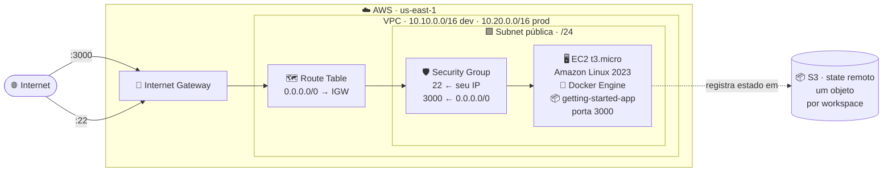
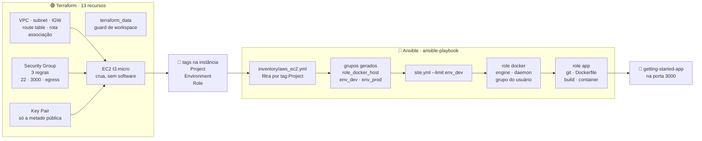

# Projeto Final — Terraform + Ansible

Projeto final da disciplina de Infraestrutura como Código (IaC) e Gerenciamento
de Configuração: provisionamento e configuração integrados, seguindo o fluxo
**Terraform provisiona → Ansible configura**. O Terraform entrega uma instância
EC2 crua; tudo que roda dentro dela — Docker Engine e o container da aplicação
[`getting-started-app`](https://github.com/docker/getting-started-app) — é
responsabilidade do Ansible.

> Todos os comandos deste documento rodam a partir deste diretório
> (`projeto-final/`). Os módulos de rede e de instância vieram da
> [Atividade 1](../atividade-1/README.md), adaptados para hospedar um container.


---

## Sumário

**Manual de operações**

- [Arquitetura](#arquitetura)
- [Estrutura de diretórios](#estrutura-de-diretórios)
- [Pré-requisitos](#pré-requisitos)
- [Execução](#execução)
- [Destruição](#destruição)
- [Troubleshooting](#troubleshooting)

**Memorial descritivo**

- [A integração Terraform → Ansible](#a-integração-terraform--ansible)
- [Decisões de arquitetura](#decisões-de-arquitetura)
- [Divergências em relação ao enunciado](#divergências-em-relação-ao-enunciado)
- [Da Atividade 1 ao Projeto Final](#da-atividade-1-ao-projeto-final)
- [Referências](#referências)
- [Créditos](#créditos)

---

## Arquitetura

São **13 recursos por workspace**: 12 na AWS e um `terraform_data` que atua
como guard de workspace.



E o fluxo entre as duas ferramentas:



O Terraform entrega **tudo que está em volta** da máquina e para na porta dela.
As tags são o único dado que atravessa a fronteira: o Ansible não lê o state,
não recebe arquivo gerado e não é chamado pelo Terraform — ele descobre a
instância perguntando à API da EC2 quais máquinas têm aquelas tags.

| Recurso | Papel |
| --- | --- |
| ☁️ **VPC** | Espaço de endereçamento isolado, um CIDR por workspace |
| 🟩 **Subnet pública** | Recorte `/24` derivado do CIDR via `cidrsubnet()` |
| 🚪 **Internet Gateway** | Dá à VPC a capacidade de falar com a internet |
| 🗺️ **Route Table** + **Route** + **Association** | É a associação que torna a subnet pública, não o nome dela |
| 🛡️ **Security Group** + 3 regras | SSH restrito ao `/32` do operador, 3000 aberta, egress liberado |
| 🔑 **Key Pair** | Registra a metade pública da chave que o Ansible usa para entrar |
| 🖥️ **EC2 t3.micro** | Host cru, com IMDSv2 obrigatório e volume raiz cifrado |
| 🚦 **terraform_data** | Guard que recusa `apply` fora dos workspaces `dev`/`prod` |

> [!NOTE]
> A instância sobe **sem nenhum software instalado**. Não há `user_data`, não
> há `provisioner`. Essa ausência é a decisão central da entrega: instalar
> software pelo Terraform mistura as responsabilidades das duas ferramentas
> exatamente como o `remote-exec` faria, só que de forma menos visível.

---

## Estrutura de diretórios

```text
projeto-final/
├── terraform/
│   ├── backend.tf              # backend S3, key própria desta entrega
│   ├── versions.tf             # required_version + required_providers
│   ├── providers.tf            # provider aws + default_tags
│   ├── locals.tf               # configuração por workspace
│   ├── variables.tf            # entradas do projeto
│   ├── main.tf                 # guard, key pair e composição dos módulos
│   ├── outputs.tf              # IP, DNS, app_url, ssh_command
│   ├── terraform.tfvars.example  # modelo comentado; copie e preencha
│   └── modules/
│       ├── network/            # VPC, subnet, IGW, rota, associação
│       └── docker-host/        # Security Group, regras e a EC2 crua
├── ansible/
│   ├── ansible.cfg             # inventário, usuário, chave, vault
│   ├── requirements.yml        # amazon.aws + community.docker
│   ├── site.yml                # aplica as roles, nesta ordem
│   ├── .vault_pass.example     # modelo da senha do cofre; a real não é versionada
│   ├── inventory/
│   │   └── aws_ec2.yml         # inventário dinâmico (a integração)
│   ├── group_vars/all/
│   │   ├── vars.yml            # indireção, em texto claro
│   │   └── vault.yml           # cifrado com ansible-vault
│   └── roles/
│       ├── docker/             # engine, daemon, grupo do usuário
│       └── app/                # clone, Dockerfile, build, container
├── docs/
│   ├── terraform.md            # como o Terraform funciona + anatomia dos .tf
│   └── ansible.md              # como o Ansible funciona + anatomia das roles
└── evidencias/
    └── README.md               # tabela das 21 evidências
```

O que veio da Atividade 1 e o que mudou está em
[Da Atividade 1 ao Projeto Final](#da-atividade-1-ao-projeto-final).

---

## Pré-requisitos

| Ferramenta | Versão usada | Observação |
| --- | --- | --- |
| Terraform | ≥ 1.10 | `use_lockfile` no backend S3 exige 1.10+ |
| Ansible | core 2.21 | instalado via `pipx` |
| AWS CLI | v2 | credenciais válidas em `us-east-1` |
| `boto3` / `botocore` | — | **no mesmo ambiente do Ansible** |

### Credenciais AWS

No **AWS Academy Learner Lab**, o bloco em *AWS Details → AWS CLI* traz
**três** valores, não dois: além de `aws_access_key_id` e
`aws_secret_access_key`, vem o `aws_session_token`. Cole os três em
`~/.aws/credentials` — omitir o token faz toda chamada falhar com
`InvalidClientTokenId`.

```bash
aws configure set region us-east-1
aws sts get-caller-identity          # quem eu sou
aws ec2 describe-regions >/dev/null  # eu posso mexer na EC2?
```

A sessão do lab expira em **3 a 4 horas** e as credenciais mudam a cada
reinício. Rode a checagem antes de cada bloco de comandos: é mais rápido que
interpretar o erro no meio de um `apply`.

> [!WARNING]
> **Só o `get-caller-identity` não serve como checagem.** Quando a sessão do
> lab termina, ele continua respondendo `200` — o `voc-cancel-cred` nega EC2,
> S3 e afins, mas não o STS. Uma chamada de EC2 é o que distingue "sessão viva"
> de "sessão cancelada", e ela também pega a falta do `aws_session_token`.

As coleções e o `boto3` são a parte que costuma falhar em silêncio:

```bash
cd ansible
ansible-galaxy collection install -r requirements.yml
```

O `boto3` precisa estar no **mesmo interpretador Python que o Ansible usa**, e
não em qualquer um do sistema. Descubra qual é e confira:

```bash
PY=$(ansible --version | sed -n 's/.*python version = .*(\(.*\))$/\1/p')
echo "$PY"
"$PY" -c "import boto3, botocore; print('ok')"
```

Se der `ModuleNotFoundError`, instale pelo método que corresponde à sua
instalação do Ansible:

```bash
pipx inject ansible boto3 botocore        # Ansible instalado via pipx
"$PY" -m pip install boto3 botocore       # qualquer outra forma
```

> [!IMPORTANT]
> Um `pip install boto3` avulso costuma cair num Python diferente do que o
> Ansible usa. O sintoma é cruel: o `ansible-inventory --graph` volta **vazio**,
> sem mensagem de erro, e parece que o filtro de tags está errado.

Repita o `"$PY" -c "import boto3..."` depois de instalar. Ele tem que imprimir
`ok` antes de você seguir.

Gere o par de chaves que o Terraform vai registrar (uma vez só):

```bash
ssh-keygen -t ed25519 -f ~/.ssh/projeto-final -N "" -C "projeto-final-iac"
```

### Você precisa do seu próprio bucket de state

O [`backend.tf`](terraform/backend.tf) aponta para o bucket desta
entrega, que **não é acessível de fora**. Nomes de bucket são únicos na AWS
inteira, então troque `SEU-NOME` por algo só seu:

```bash
export BUCKET="tfstate-projeto-final-SEU-NOME"

# 1) Criar o bucket (us-east-1 é a única região que NÃO aceita
#    --create-bucket-configuration):
aws s3api create-bucket --bucket "$BUCKET" --region us-east-1

# 2) Versionamento: permite recuperar um state corrompido:
aws s3api put-bucket-versioning --bucket "$BUCKET" \
  --versioning-configuration Status=Enabled

# 3) O state guarda dados sensíveis em texto plano; bloqueie acesso público:
aws s3api put-public-access-block --bucket "$BUCKET" \
  --public-access-block-configuration \
  "BlockPublicAcls=true,IgnorePublicAcls=true,BlockPublicPolicy=true,RestrictPublicBuckets=true"

# 4) E cifre em repouso:
aws s3api put-bucket-encryption --bucket "$BUCKET" \
  --server-side-encryption-configuration \
  '{"Rules":[{"ApplyServerSideEncryptionByDefault":{"SSEAlgorithm":"AES256"}}]}'
```

O `init` mais adiante recebe esse bucket por `-backend-config`, sem editar o
`backend.tf`.

### Você precisa recriar o vault

O [`vault.yml`](ansible/group_vars/all/vault.yml) está versionado
**cifrado** — é assim que o `ansible-vault` deve ser usado. Mas a senha que o
abre vive em `.vault_pass`, que está no `.gitignore` e não vem no clone. Sem
ela, qualquer `ansible-playbook` falha na decifragem.

O que **vem** no clone é o
[`.vault_pass.example`](ansible/.vault_pass.example), e ele mostra o formato:
uma linha, só a senha, sem comentário nenhum — o arquivo inteiro *é* a senha.

Como o valor protegido é uma **senha de admin simulada**, que não dá acesso a
nada, recrie o cofre com a sua própria senha.

> [!NOTE]
> Se preferir acessar o cofre deste repositório em vez de criar o seu, envie um
> e-mail solicitando a senha para **wjgcl@cesar.school**. Ela não está
> versionada de propósito: publicar a senha ao lado do arquivo que ela decifra
> anularia a proteção do `ansible-vault`.

Para criar o seu:

```bash
cd ansible

openssl rand -base64 32 > .vault_pass
chmod 600 .vault_pass

rm group_vars/all/vault.yml
ansible-vault create group_vars/all/vault.yml
```

No editor que abrir, uma linha:

```yaml
vault_app_admin_password: "qualquer-valor-ficticio"
```

Confirme que ficou cifrado — a primeira linha tem que ser o cabeçalho do vault:

```bash
head -1 group_vars/all/vault.yml     # $ANSIBLE_VAULT;1.1;AES256
```

Com isso pronto, a [Execução](#execução) leva do clone à aplicação no ar em
seis passos.

---

## Execução

Com os [pré-requisitos](#pré-requisitos) resolvidos — coleções, `boto3`, par de
chaves, cofre e bucket —, os comandos abaixo são exatamente os que produziram
as [evidências](#evidências-da-entrega).

> [!NOTE]
> Os `cd` sem `../` partem **deste diretório** (`projeto-final/`); os com `../`
> são relativos ao passo anterior. Se estiver perdido, volte para cá com
> `cd "$(git rev-parse --show-toplevel)/projeto-final"`.

```bash
cd "$(git rev-parse --show-toplevel)/projeto-final"
export BUCKET="tfstate-projeto-final-SEU-NOME"    # o bucket que você criou
```

### 1. Provisionar em `dev`

Só **duas** variáveis são obrigatórias. Troque o valor de `OWNER` e cole o bloco
inteiro: ele resolve o seu IP público na hora e escreve o `terraform.tfvars`
pronto.

```bash
cd terraform
export OWNER="Seu Nome"

cat > terraform.tfvars <<EOF
owner            = "$OWNER"
ssh_ingress_cidr = "$(curl -s https://checkip.amazonaws.com)/32"
EOF

terraform init -backend-config="bucket=$BUCKET"
terraform fmt -check -recursive
terraform validate
terraform workspace select -or-create dev
terraform apply                      # espere: Plan: 13 to add
terraform output
```

```text
app_url             = "http://<ip>:3000"
app_url_dns         = "http://<dns>:3000"
instance_public_ip  = "<ip>"
ssh_command         = "ssh -i ~/.ssh/projeto-final ec2-user@<ip>"
workspace           = "dev"
```

`terraform.tfvars` está no `.gitignore`: ele guarda o IP de quem executa, e o IP
residencial muda — reconfirme antes de cada `apply`. Para preencher à mão em vez
de gerar, o
[`terraform.tfvars.example`](terraform/terraform.tfvars.example) traz todas as
variáveis comentadas, obrigatórias e opcionais.

### 2. Conferir a descoberta antes de configurar

```bash
cd ../ansible
ansible-inventory --graph
```

```text
@all:
  |--@ungrouped:
  |--@aws_ec2:
  |  |--projeto-final-pos-devops-iac-dev-host-instance
  |--@role_docker_host:
  |  |--projeto-final-pos-devops-iac-dev-host-instance
  |--@env_dev:
  |  |--projeto-final-pos-devops-iac-dev-host-instance
```

> [!IMPORTANT]
> Se os grupos vierem vazios, **pare aqui**. Rodar o playbook contra um
> inventário vazio termina em `ok=0 changed=0`, que se parece com sucesso.

### 3. Configurar

```bash
ansible-playbook site.yml --limit env_dev
```

```text
PLAY RECAP ***********************************************************
...dev-host-instance : ok=9  changed=8  unreachable=0  failed=0
```

### 4. Provar a idempotência

Sem alterar nada — nem código, nem infraestrutura:

```bash
ansible-playbook site.yml --limit env_dev
```

```text
PLAY RECAP ***********************************************************
...dev-host-instance : ok=9  changed=0  unreachable=0  failed=0
```

### 5. Acessar

```bash
cd ../terraform
curl -si "$(terraform output -raw app_url)" | head -5

# O echo acrescenta a quebra de linha que o -raw omite, deixando a URL
# clicável no terminal. Sem ele o zsh imprime um "%" no fim, que o
# detector de links captura junto e invalida o endereço.
echo "$(terraform output -raw app_url)"        # pelo IP
echo "$(terraform output -raw app_url_dns)"    # pelo DNS público
```

Para abrir direto do terminal, sem clicar:

```bash
explorer.exe "$(terraform output -raw app_url)"   # WSL
open        "$(terraform output -raw app_url)"    # macOS
xdg-open    "$(terraform output -raw app_url)"    # Linux com desktop
```

As duas URLs carregam a porta explicitamente. O Security Group abre apenas 22 e
3000, então um hostname sem porta cai na 80 e resulta em timeout.

### 6. Repetir em `prod`

```bash
terraform workspace select -or-create prod
terraform apply
cd ../ansible && ansible-playbook site.yml --limit env_prod
```

Cada workspace tem CIDR próprio e um objeto de state próprio no bucket —
`projeto-final/terraform.tfstate` para o `dev` e
`env:/prod/projeto-final/terraform.tfstate` para o `prod`.

> [!TIP]
> Deu erro? O [Troubleshooting](#troubleshooting) cobre os casos mais comuns,
> incluindo o inventário vazio, o `explicit deny` de sessão expirada do Learner
> Lab e o SSH que expira enquanto a instância ainda está subindo.

---

## Destruição

```bash
cd terraform

terraform workspace select prod && terraform destroy
terraform workspace select dev  && terraform destroy
```

```text
Destroy complete! Resources: 13 destroyed.     # prod
Destroy complete! Resources: 13 destroyed.     # dev
```

O bucket do backend **não** é destruído: ele pertence a outro ciclo de vida e
guarda o histórico do state. Apague manualmente se não for mais usá-lo.

---

## Troubleshooting

**`ansible-inventory --graph` volta vazio**
A tag `Project` da instância não casa com o filtro do `aws_ec2.yml`, ou a
instância ainda não está `running`. Confirme com
`aws ec2 describe-instances --filters "Name=tag:Project,Values=..."`.

**`UNREACHABLE! ... Connection timed out during banner exchange`**
A instância respondeu ao Terraform antes do `sshd` terminar de subir — é o que
a `evidencia_12` registra. Repetir o playbook resolve; nenhuma task chegou a
executar, então não há estado parcial.

**O playbook trava em `Gathering Facts` depois de uma falha de conexão**
O Ansible reaproveita conexões SSH via `ControlMaster`. Uma conexão que morreu
deixa o socket para trás e as execuções seguintes esperam por um mestre que
não existe mais:

```bash
rm -f ~/.ansible/cp/*
```

**`Error acquiring the state lock` com `PreconditionFailed`**
Lock órfão de um `terraform` interrompido. Confirme que nenhum processo está
ativo (`pgrep -a terraform`) e destrave com o ID informado na mensagem:

```bash
terraform force-unlock <LOCK_ID>
```

Nunca use `-lock=false` para contornar: é o caminho que corrompe state.

**`[WARNING]: Found variable using reserved name 'tags'`**
O plugin `aws_ec2` publica as tags da instância numa hostvar chamada `tags`, e
`tags` é uma das 76 palavras reservadas do Ansible. O aviso é inofensivo:
nenhuma task do projeto usa `tags` como palavra-chave, e o `keyed_groups`
resolve as tags dentro do plugin, antes da resolução de variáveis.

**`UnauthorizedOperation` com `explicit deny` na policy `voc-cancel-cred`**
A sessão do Learner Lab terminou. As credenciais ainda existem em
`~/.aws/credentials`, mas o lab anexou uma policy de negação explícita — por
isso o erro fala em autorização, e não em token inválido. Reinicie o lab e cole
as credenciais novas; não é erro de código.

```text
An error occurred (UnauthorizedOperation) ... is not authorized to perform:
ec2:DescribeInstances with an explicit deny in an identity-based policy:
arn:aws:iam::...:policy/voc-cancel-cred
```

**`InvalidClientTokenId` em qualquer comando `aws`**
Falta o `aws_session_token` em `~/.aws/credentials`. O Learner Lab entrega três
valores; com dois, a autenticação nunca completa.

**A aplicação não responde pelo DNS**
Confira se a URL tem a porta. O Security Group abre apenas 22 e 3000; um
hostname sem `:3000` vai para a porta 80 e resulta em timeout. Use
`echo "$(terraform output -raw app_url_dns)"`, que monta a URL completa e ainda
imprime a quebra de linha que o terminal precisa para reconhecer o link.

---

## A integração Terraform → Ansible

Aqui começa o memorial. Você já rodou o projeto; esta seção explica **como** o
Ansible encontrou a máquina que o Terraform criou, sem nenhum arquivo escrito à
mão entre os dois.

### Opção escolhida: **A — inventário dinâmico + execução manual**

O enunciado aceita duas formas. Esta entrega usa a **Opção A**: o Ansible
descobre a infraestrutura consultando a API da EC2 através do plugin
`amazon.aws.aws_ec2`, e o `ansible-playbook` é executado como um passo
próprio, depois do `terraform apply`.

Com as duas etapas independentes, reexecutar só a configuração é um comando:
você roda o playbook de novo, e o Terraform nem fica sabendo. Nenhum recurso
precisa ser recriado para o Ansible rodar outra vez.

É isso que torna a segunda execução — a que comprova `changed=0` — apenas
repetir um comando.

### O que dispara o quê, em que ordem

| # | Arquivo | O que faz, e o que isso produz |
| --- | --- | --- |
| 1 | `terraform/main.tf` | Cria key pair, VPC e instância → uma EC2 com as tags `Project`, `Environment` e `Role` |
| 2 | `terraform/providers.tf` | `default_tags` aplica `Project` e `Environment` a **todo** recurso → as tags que o passo 3 filtra |
| 3 | `ansible/inventory/aws_ec2.yml` | Consulta a EC2 e converte tags em grupos → `role_docker_host`, `env_dev`, `env_prod` |
| 4 | `ansible/ansible.cfg` | Aponta inventário, usuário e chave privada → conexão SSH sem flags na linha de comando |
| 5 | `ansible/site.yml` | Mira `role_docker_host` e aplica as roles na ordem em que estão escritas |
| 6 | `ansible/roles/docker` | Engine, daemon habilitado, usuário no grupo → host pronto para os módulos `community.docker` |
| 7 | `ansible/roles/app` | Clona, renderiza o Dockerfile, builda e sobe o container → aplicação em `:3000` |

Nada nesse encadeamento passa por arquivo escrito à mão: o único acoplamento
entre as duas ferramentas são **as tags**.

### A costura: uma tag dos dois lados

O ponto exato onde o Terraform encontra o Ansible:

```hcl
# terraform/providers.tf -- aplicado a todo recurso taggável
default_tags {
  tags = {
    Environment = terraform.workspace          # dev | prod
    Project     = var.project_name             # projeto-final-pos-devops-iac
  }
}
```
```hcl
# terraform/modules/docker-host/main.tf -- na instância
tags = merge(var.tags, {
  Role = "docker-host"
})
```
```yaml
# ansible/inventory/aws_ec2.yml
filters:
  tag:Project: projeto-final-pos-devops-iac    # tem que casar com var.project_name
  instance-state-name: running

keyed_groups:
  - key: tags.Role                             # docker-host -> role_docker_host
    prefix: role
  - key: tags.Environment                      # dev -> env_dev
    prefix: env

compose:
  ansible_host: public_ip_address              # sem isto, o plugin entrega o DNS privado
```

Trocar `var.project_name` de um lado sem trocar do outro faz o inventário
voltar vazio — e o Ansible **não falha** nesse caso, apenas termina com
`ok=0`, o que parece sucesso. É por isso que `ansible-inventory --graph` é um
passo obrigatório do roteiro de execução, e não um comando de depuração.

### Onde cada abordagem executa

| Abordagem | Onde roda | Implicação |
| --- | --- | --- |
| `remote-exec` | Dentro do servidor | Configuraria a instância no lugar do Ansible. Proibido pelo enunciado |
| `local-exec` | Na máquina do operador | Alternativa aceita pelo enunciado (Opção B). Roda como parte do `terraform apply`: a configuração deixa de ser um passo que se repete sozinho, e uma falha do Ansible marca o recurso do Terraform como problemático |
| **inventário dinâmico** | Etapas separadas | **Adotado nesta entrega.** Cada ferramenta roda por conta própria: reexecutar a configuração não exige tocar na infraestrutura, e uma falha do Ansible não marca recurso nenhum do Terraform |

Esta entrega adotou a terceira linha, e o código não tem **nenhum** bloco
`provisioner`:

```text
$ grep -rn 'provisioner\|remote-exec' terraform --include='*.tf'
terraform/modules/docker-host/main.tf:2:# installing software mixes the same responsibilities as provisioner
terraform/modules/docker-host/main.tf:3:# "remote-exec" -- everything inside the instance belongs to Ansible.
```

As duas únicas ocorrências estão num comentário explicando por que o padrão
não é usado.

Manter o playbook fora do `terraform apply` muda duas coisas concretas: **o que
custa rodar de novo** e **o que acontece quando o Ansible falha**. As duas
seguem do mesmo fato — na Opção B o playbook é um passo de dentro do `apply`;
na Opção A, um comando à parte.

#### Rodar de novo

Na Opção A é um comando: `ansible-playbook site.yml` outra vez, e o Terraform
nem fica sabendo.

Na Opção B, não. Um segundo `terraform apply` **não** reexecuta o playbook — o
`null_resource` não mudou, então o provisioner não dispara. Para provar o
`changed=0` que o enunciado cobra, você acaba rodando o playbook à parte assim
mesmo, ou forçando a recriação do recurso.

> [!NOTE]
> Idempotência não é privilégio da Opção A. O Terraform é idempotente por
> construção, e o `changed=0` do Ansible é cobrado nas duas opções. O que muda
> é o custo de chegar lá.

#### Quando o Ansible falha

Ao terminar, o `ansible-playbook` devolve um **código de saída** — e na Opção B
é esse número que o Terraform observa.

Zero, e o `apply` segue como se nada tivesse acontecido. Qualquer outro valor, e
três coisas acontecem em sequência:

1. o `apply` termina com erro;
2. o recurso onde o provisioner está declarado é marcado como *tainted*;
3. o **próximo** `apply` destrói e recria esse recurso — o Terraform deixou de
   confiar que ele foi configurado corretamente.

O tamanho do estrago depende de onde o provisioner está declarado. Preso ao
`aws_instance`, um erro de playbook custa **recriar a máquina inteira**. Num
`null_resource` com `triggers`, como o enunciado sugere, recria só o recurso
lógico, que não existe na AWS e não custa nada — é por isso que essa é a
montagem recomendada da Opção B.

Dá para desarmar com `on_failure = continue`, que faz o Terraform registrar o
erro e seguir sem marcar nada:

```hcl
provisioner "local-exec" {
  command    = "ansible-playbook ..."
  on_failure = continue    # palavra nua, não string
}
```

Mas isso troca uma falha barulhenta por uma silenciosa: o `apply` termina verde,
o servidor fica sem configuração, e o problema reaparece mais tarde como "a
aplicação não responde". Num fluxo em que o Ansible é a única coisa que instala
software, é o pior negócio possível.

Na Opção A nada disso existe: o `ansible-playbook` é um comando próprio, e uma
falha dele não tem como marcar recurso nenhum do Terraform.

---

## Decisões de arquitetura

**A instância sobe crua.** Sem `user_data`, sem pacotes, sem aplicação. Essa
ausência é o coração da entrega: qualquer instalação feita pelo Terraform
mistura as responsabilidades das duas ferramentas.

**O par de chaves é gerenciado pelo Terraform.** O Learner Lab oferece uma
chave `vockey` pronta, criada fora do código — usá-la deixaria um recurso
manual no caminho crítico. O projeto registra o seu próprio par a partir de
uma chave gerada localmente: só a metade pública chega à AWS, e a privada
nunca entra no state.

**O nome do key pair deriva do `name_prefix`.** Nomes de key pair são únicos
por região, não por workspace: um nome fixo funciona no `dev` e falha no
`prod` com `InvalidKeyPair.Duplicate`.

**Regras de Security Group como recursos separados.**
`aws_vpc_security_group_ingress_rule` em vez de blocos `ingress` embutidos —
alterar uma regra não recria o grupo inteiro.

**`docker_image` com `source: build`, não `docker_image_build`.** O módulo
mais novo exige o plugin `buildx` no host, que o pacote `docker` do Amazon
Linux 2023 não garante. O `docker_image` conversa com a API do Docker através
do `requests`, que a role já instala.

**`python3-requests` via `dnf`, não `pip install docker`.** A `community.docker`
abandonou o SDK `docker-py` na versão 4.0 e hoje fala com a API por HTTP; a
única dependência Python real é `requests`. O AL2023 ainda recusa `pip install`
no Python do sistema por PEP 668.

**`force_source` no default (`false`).** A única checagem de idempotência do
`docker_image` é se a imagem já existe. Forçar a origem rebuilda a cada
execução e destrói o `changed=0`.

**`no_log` na task do container.** A senha do vault é passada como variável de
ambiente; sem `no_log`, uma falha nessa task imprimiria os argumentos do
módulo — senha inclusive — no arquivo de evidência.

---

## Divergências em relação ao enunciado

**O plugin de inventário chama-se `amazon.aws.aws_ec2`.** O enunciado cita
`amazon.aws.ec2_instance`, que é o **módulo** usado para *criar* instâncias —
papel que aqui é do Terraform. O plugin de inventário tem outro nome, e o
arquivo de configuração precisa terminar em `aws_ec2.yml` ou `aws_ec2.yaml`,
caso contrário é ignorado sem erro.

**Código e comentários em inglês, README em português.** Mesmo critério
adotado na Atividade 1: o código segue o padrão de mercado, a documentação
segue a língua da disciplina.

**Conexão por SSH, não pelo plugin `aws_ssm`.** O Ansible sabe alcançar uma EC2
sem SSH: o plugin de conexão `amazon.aws.aws_ssm` executa as tasks por dentro de
uma sessão do Systems Manager, e vem na mesma coleção que esta entrega já
instala. Trocar o transporte seria uma linha no `ansible.cfg`, e a porta 22
poderia sumir do Security Group.

Ele não foi usado porque a instância precisaria estar registrada no SSM como
*managed node*, e isso exige um *instance profile* IAM com a política
`AmazonSSMManagedInstanceCore` — o Learner Lab não permite criar roles IAM. O
plugin ainda pede um bucket S3 para a transferência de arquivos e o
`session-manager-plugin` instalado na máquina de controle.

Daí o SSH com chave, com a porta 22 restrita a um único `/32` no Security Group.
Fora do laboratório, o `aws_ssm` seria a escolha melhor: nenhuma porta de
entrada aberta, nenhuma chave privada para distribuir, e cada comando registrado
no CloudTrail.

**`host_key_checking = False`.** O IP público muda a cada `apply`/`destroy`, e
a verificação de host key geraria prompt interativo a cada execução. É um
desvio consciente e aceitável em laboratório; em produção seria um vetor de
man-in-the-middle e deveria permanecer ativo.

---

## Da Atividade 1 ao Projeto Final

O enunciado autoriza e incentiva reaproveitar os módulos da Atividade 1. Esta
seção registra exatamente o que foi herdado, o que foi adaptado e o que nasceu
aqui — o `git log` mostra o mesmo, commit a commit, a partir de
`chore: scaffold the final project from the atividade-1 base`.

A cópia foi deliberada, em vez de um módulo compartilhado entre as duas
entregas. A Atividade 1 já foi avaliada e está marcada pela tag
`entrega-atividade-1`; um módulo comum faria qualquer ajuste feito aqui alterar,
retroativamente, o código daquela entrega.

### O que veio inteiro

| Componente | Situação |
| --- | --- |
| `modules/network/` | **Idêntico**, byte a byte. VPC, subnet derivada por `cidrsubnet()`, IGW, route table, rota e associação servem igual — a rede não muda por causa do que roda dentro da instância |
| Guard de workspace | O `terraform_data` com `precondition` que recusa `apply` fora de `dev`/`prod` |
| `default_tags` no provider | Mesma estratégia de tagging; ganhou importância nova, porque agora as tags são o que o Ansible consulta |
| Backend S3 com `use_lockfile` | Mesma mecânica, `key` diferente |

### O que foi adaptado

O módulo `web-server` virou `docker-host`. O nome mudou porque a
responsabilidade mudou: ele não serve mais uma página, entrega um host cru.

| | Atividade 1 (`web-server`) | Projeto Final (`docker-host`) |
| --- | --- | --- |
| `user_data` | Script de boot que instalava `httpd` e escrevia o HTML | **Removido.** Nada é instalado pelo Terraform |
| `templates/` | `index.html.tftpl` e `user_data.sh.tftpl` | **Removidos** — a página agora é o container |
| Porta publicada | 80 (`http_port`) | 3000 (`app_port`) |
| `key_name` | Opcional (`default = null`) | **Obrigatório** — sem SSH o Ansible não alcança a máquina |
| Tags da instância | `Name` | `Name` + `Role = "docker-host"`, que o inventário dinâmico filtra |
| Variáveis | 15 | 7 — saíram as nove de conteúdo da página |

Na raiz, a mesma subtração:

```diff
- student_name, class_name, page_title, page_subtitle,
- stack_items, course_name, professor_name    (conteúdo da página)
- http_port                                    (renomeada)
- key_name                                     (deixou de ser entrada do usuário)
+ app_port                                     (a porta do container)
+ public_key_path                              (a chave que o Terraform registra)
```

### O que nasceu aqui

**`aws_key_pair`** — a Atividade 1 aceitava uma chave que já existisse na conta.
Aqui o Terraform registra a sua própria, a partir de uma chave gerada
localmente, porque o Ansible depende do SSH e o enunciado não admite recurso
criado fora do código.

**Todo o diretório `ansible/`** — inventário dinâmico, `site.yml`, as duas roles
e o vault. É a metade da entrega que não tem precedente na Atividade 1.

**As tags como contrato.** Na Atividade 1 elas eram organização e rastreio de
custo. Aqui `Project`, `Environment` e `Role` viraram interface entre duas
ferramentas: mudar um valor sem mudar o filtro do inventário quebra o fluxo.

### O que a Atividade 1 ensinou e não mudou

As decisões de segurança e estilo atravessaram inteiras: IMDSv2 obrigatório,
volume raiz cifrado, SSH restrito a um `/32`, regras de Security Group como
recursos separados, AMI pelo SSM Parameter Store, `insecure_value` para o
parâmetro não sair censurado do plano, validações nas variáveis dos módulos e
código em inglês.

---

## Referências

### Evidências da entrega

As 21 evidências da execução completa — `apply` e `destroy` nos dois workspaces,
as duas execuções do playbook que provam o `changed=0`, a aplicação no navegador
pelo IP e pelo DNS, e o vault cifrado — estão em
**[`evidencias/`](evidencias/README.md)**, com uma tabela dizendo o que cada
arquivo prova.

> O IP residencial do operador aparece como `203.0.113.42/32` (RFC 5737) e o
> ID da conta como `123456789012`. O que a evidência prova — porta 22 restrita
> a um único `/32` — não muda.

### Como as ferramentas funcionam

O que cada ferramenta faz, como ela decide o que fazer, e o passeio arquivo por
arquivo pelo código desta entrega ficam em dois documentos à parte, para este
README continuar sendo o manual de execução:

| Documento | O que traz |
| --- | --- |
| **[docs/terraform.md](docs/terraform.md)** | Como o Terraform funciona · anatomia dos sete arquivos `.tf` da raiz e dos dois módulos |
| **[docs/ansible.md](docs/ansible.md)** | Como o Ansible funciona · anatomia do `ansible.cfg`, do inventário, do `site.yml` e das duas roles |

As duas ferramentas convergem para um estado desejado por caminhos opostos — o
Terraform ordena o trabalho por um grafo de dependências e lembra do passado
pelo state; o Ansible executa literalmente de cima para baixo e pergunta ao host
toda vez. Ler os dois documentos em sequência é o jeito mais rápido de ver onde
uma termina e a outra começa.

---

## Créditos

Disciplina de **Infraestrutura como Código (IaC) e Gerenciamento de Configuração**,
ministrada por **Cris Apolinário**, na especialização em DevOps da CESAR School.

A aplicação hospedada é a
[`getting-started-app`](https://github.com/docker/getting-started-app), exemplo
oficial da documentação do Docker.
