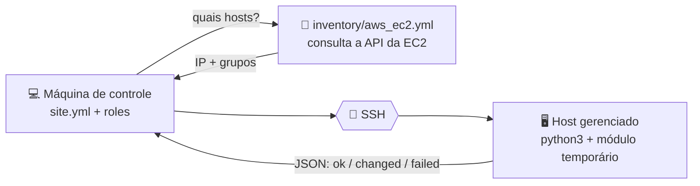

# Ansible — conceitos e anatomia dos arquivos

Referência conceitual do [Projeto Final](../README.md): o que o Ansible faz,
como ele decide o que fazer, e o passeio arquivo por arquivo pelo código de
[`ansible/`](../ansible/).

O par desta página é [Terraform — conceitos e anatomia dos arquivos](terraform.md).
As duas ferramentas convergem para um estado desejado por caminhos opostos — o
Terraform ordena o trabalho por um grafo de dependências e lembra do passado
pelo state; o Ansible executa literalmente de cima para baixo e pergunta ao
host toda vez. Ler as duas em sequência é o jeito mais rápido de ver onde uma
termina e a outra começa.

- [Como o Ansible funciona](#como-o-ansible-funciona)
- [Anatomia dos arquivos do Ansible](#anatomia-dos-arquivos-do-ansible)

---

## Como o Ansible funciona

O Ansible é **imperativo na ordem, declarativo no resultado**: você escreve
tasks numa sequência que é executada de cima para baixo, mas cada task descreve
um *estado desejado* — "o pacote deve estar presente", "o serviço deve estar
rodando" — e não um comando a executar. É dessa distinção que nasce a
idempotência: rodar duas vezes não faz o trabalho duas vezes.

Ele é **agentless**: nada é instalado no servidor. A máquina de controle abre
uma sessão SSH, copia um módulo Python para um diretório temporário no host,
executa, coleta o resultado em JSON e apaga o módulo.



| Comando | O que faz |
| --- | --- |
| `ansible-galaxy collection install -r requirements.yml` | Instala as coleções declaradas |
| `ansible-inventory --graph` | Mostra os grupos e hosts **sem** conectar em nenhum |
| `ansible-playbook --syntax-check site.yml` | Valida YAML e resolução de roles, offline |
| `ansible-playbook site.yml --limit env_dev` | Executa, restrito a um grupo |
| `ansible-playbook site.yml --check` | Simula: relata o que mudaria sem mudar |
| `ansible-vault encrypt \| view \| edit` | Cifra, lê e edita arquivos de segredo |

> [!IMPORTANT]
> **Por que a idempotência é o critério.** Um script `bash` que roda
> `dnf install docker` funciona na primeira vez e é ruído na segunda. Um módulo
> idempotente consulta o estado atual antes de agir e só reporta `changed`
> quando de fato alterou algo. É por isso que a segunda execução deste playbook
> termina com `changed=0`, e é por isso que `command`/`shell` são evitados: eles
> não sabem consultar estado, então são sempre `changed`.

**O contraste com o Terraform.** As duas ferramentas convergem para um estado
desejado, mas por caminhos opostos:

| | Terraform | Ansible |
| --- | --- | --- |
| Conhece o passado | Sim, pelo **state** | Não: consulta o host a cada execução |
| Ordem de execução | Derivada do **grafo** de dependências | **Literal**, de cima para baixo |
| Se você apagar um recurso do código | Ele é destruído | Nada acontece: a task deixa de existir |
| Escopo | O que está *em volta* da máquina | O que está *dentro* da máquina |

A terceira linha é a mais importante na prática: remover uma task do playbook
**não desfaz** o que ela fez. Desinstalar exige uma task explícita com
`state: absent`.

**Referências oficiais:**

- [Módulos e idempotência][ans-idem]
- [Plugin de inventário `aws_ec2`][ans-aws-ec2]
- [Ansible Vault][ans-vault]

[ans-idem]: https://docs.ansible.com/ansible/latest/reference_appendices/glossary.html#term-Idempotency
[ans-aws-ec2]: https://docs.ansible.com/ansible/latest/collections/amazon/aws/aws_ec2_inventory.html
[ans-vault]: https://docs.ansible.com/ansible/latest/vault_guide/index.html

---

## Anatomia dos arquivos do Ansible

### A ordem das tasks é literal

No Terraform, a ordem dos arquivos e dos blocos é irrelevante — o grafo de
dependências decide. No Ansible é o oposto: **a ordem em que você escreve é a
ordem em que executa**, e não há grafo para consertar um encadeamento errado.

É por isso que `site.yml` aplica `docker` antes de `app`: a role `app` chama
módulos que conversam com o daemon do Docker, e o daemon precisa estar de pé.
Inverter as duas linhas não gera erro de sintaxe — gera falha em execução.

Dentro de uma role, a ordem também é literal. As três tasks de `docker`
instalam, sobem o serviço e ajustam o grupo, nessa sequência, porque `dnf
install` não inicia serviço e `systemd` não instala pacote.

### Os módulos usados neste projeto

| Módulo | Onde | O que garante |
| --- | --- | --- |
| `ansible.builtin.dnf` | ambas as roles | Pacote presente (`state: present`, não `latest`) |
| `ansible.builtin.systemd_service` | `docker` | Serviço rodando **e** habilitado no boot |
| `ansible.builtin.user` | `docker` | Usuário no grupo `docker`, com `append: true` |
| `ansible.builtin.git` | `app` | Repositório clonado na revisão pedida |
| `ansible.builtin.template` | `app` | Dockerfile renderizado a partir do `.j2` |
| `community.docker.docker_image` | `app` | Imagem construída, se ainda não existir |
| `community.docker.docker_container` | `app` | Container rodando com a configuração descrita |

Todos usam **FQCN** (`namespace.coleção.módulo`). Nome curto (`dnf:`) ainda
funciona, mas depende da resolução implícita de coleções — o nome completo
torna explícito de onde o módulo vem.

Não há **nenhum** `command` ou `shell` no projeto:

```text
$ grep -rn 'ansible.builtin.command\|ansible.builtin.shell' ansible
$ echo $?
1
```

### Arquivo por arquivo: a raiz do `ansible/`

<details>
<summary><b>1. <code>ansible.cfg</code></b>: como conectar, sem repetir flags</summary>

```ini
[defaults]
inventory = inventory/aws_ec2.yml
remote_user = ec2-user
private_key_file = ~/.ssh/projeto-final
host_key_checking = False
deprecation_warnings = False
vault_password_file = .vault_pass
```

Sem ele, cada execução precisaria repetir `-i`, `-u` e `--private-key` na linha
de comando. Dois detalhes que economizam depuração:

- Caminhos relativos aqui resolvem **em relação ao arquivo de configuração**,
  não ao diretório de onde você chama o comando.
- `vault_password_file` apontando para um arquivo inexistente **aborta**
  qualquer comando, inclusive `--syntax-check`. Ele não é ignorado.

</details>

<details>
<summary><b>2. <code>requirements.yml</code></b>: do que o projeto depende</summary>

```yaml
collections:
  - name: amazon.aws          # plugin de inventário aws_ec2
    version: ">=11.4.0,<12.0.0"

  - name: community.docker    # docker_image, docker_container
    version: ">=5.2.1,<6.0.0"
```

Declara o que o projeto precisa para rodar em outra máquina. É o equivalente ao
`required_providers` do Terraform, com uma diferença importante: o Ansible
**não tem** arquivo de lock. Sem a restrição de versão, um clone novo instala o
que estiver publicado no dia.

E isso não é risco teórico. A `community.docker` já removeu o SDK `docker-py`
numa virada de major, e a documentação atual dela recomenda trocar o
`docker_image` pelos módulos separados — ou seja, uma major nova pode retirar
exatamente o que a role `app` chama. As faixas acima aceitam correções dentro
da major testada e barram a próxima.

</details>

<details>
<summary><b>3. <code>site.yml</code></b>: onde, com que privilégio e o quê</summary>

```yaml
- name: Configure the docker host
  hosts: role_docker_host
  become: true
  gather_facts: true

  roles:
    - docker
    - app
```

Seis linhas, nenhuma task solta. O playbook responde três perguntas — **onde**
(`hosts`), **com que privilégio** (`become`) e **o quê** (`roles`) — e delega o
*como* às roles. Quem abre este arquivo entende a entrega em cinco segundos.

`become: true` no play, e não em cada task, porque as sete tasks precisam de
root. `gather_facts: true` custa uma conexão a mais e popula `ansible_facts`.

</details>

<details>
<summary><b>4. <code>inventory/aws_ec2.yml</code></b>: a costura com o Terraform</summary>

O arquivo da integração, detalhado em
[A integração Terraform → Ansible](../README.md#a-integração-terraform--ansible). Três
regras que não são óbvias:

1. O nome do arquivo **precisa** terminar em `aws_ec2.yml` ou `aws_ec2.yaml`;
   qualquer outro nome é ignorado sem mensagem de erro.
2. O plugin roda no Python do Ansible e exige `boto3`/`botocore` **nesse mesmo
   ambiente** — num Ansible instalado por `pipx`, um `pip install boto3` comum
   não é enxergado.
3. `compose: ansible_host: public_ip_address` é obrigatório: sem ele o plugin
   entrega o DNS privado, que não resolve fora da VPC.

</details>

### O contrato de uma role

Uma role é uma pasta com nomes fixos. O Ansible carrega cada subpasta
automaticamente pelo nome — não existe arquivo declarando caminhos.

```text
roles/docker/
├── tasks/main.yml        # o que fazer, na ordem em que executa
├── defaults/main.yml     # valores que quem usa a role PODE sobrescrever
├── vars/main.yml         # valores internos, que NÃO deveriam ser trocados
└── meta/main.yml         # autor, licença, plataformas, dependências
```

A distinção entre `defaults/` e `vars/` é a parte que mais confunde, e ela não é
sobre onde o valor mora — é sobre **prioridade**:

| | `defaults/main.yml` | `vars/main.yml` |
| --- | --- | --- |
| Prioridade | A mais baixa de todas | Alta |
| Intenção | "Troque se precisar" | "Isto é lógica interna da role" |
| Neste projeto | `app_node_image`, `app_port`, URL do repositório | nome do pacote `docker`, `/opt/getting-started-app` |

A pergunta que decide onde colocar uma variável: *se alguém sobrescrever isto de
fora, a role continua correta?* Se sim, `defaults/`. Se a role quebra, `vars/`.

Duas pastas que o `ansible-galaxy init` cria e que este projeto **não** usa
foram removidas: `handlers/` (não há serviço a recarregar depois de um template
mudar) e `tests/` (destinada a publicação no Galaxy).

Toda variável leva o nome da role como prefixo — `docker_packages`,
`app_container_name`. Variáveis de role vivem num espaço de nomes global: sem o
prefixo, um `packages` da role `docker` colidiria com um `packages` da role
`app`, e a última carregada venceria em silêncio.

### Arquivo por arquivo: as roles

<details>
<summary><b>5. <code>roles/docker</code></b>: o host pronto para o Docker</summary>

Três tasks, respondendo "o que precisa ser verdade para os módulos
`community.docker` funcionarem?".

```yaml
- name: Install the docker engine and the collection's python dependency
  ansible.builtin.dnf:
    name: "{{ docker_packages }}"      # docker + python3-requests
    state: present
```

`state: present` verifica e não age se já estiver instalado. `state: latest`
consultaria o repositório a cada execução e reportaria `changed` sempre que a
Amazon publicasse uma versão nova — **`present` é idempotente, `latest` não é**.

O segundo pacote é o que surpreende: a `community.docker` abandonou o SDK
`docker-py` na versão 4.0 e hoje fala com a API do Docker por HTTP. A única
dependência Python real é `requests`, que no AL2023 vem do pacote
`python3-requests` — e não de um `pip install docker`, que o sistema recusa por
PEP 668.

```yaml
- name: Ensure the docker daemon is running and starts on boot
  ansible.builtin.systemd_service:
    name: "{{ docker_service_name }}"
    state: started       # agora
    enabled: true        # depois do reboot
```

Instalar não é o mesmo que rodar: o `dnf` não sobe o serviço, e no AL2023 o
daemon vem desabilitado por padrão. Um argumento sem o outro é meio serviço.

```yaml
- name: Let the login user reach the docker socket without sudo
  ansible.builtin.user:
    name: "{{ docker_admin_user }}"
    groups: docker
    append: true
```

O argumento `groups` é **absoluto**: ele descreve o conjunto completo de grupos
secundários. Sem `append: true`, o Ansible entenderia "os grupos deste usuário
devem ser exatamente `[docker]`" e removeria o `ec2-user` de `adm`, `wheel` e
`systemd-journal` — tirando o `sudo` da máquina onde o `sudo` é a única forma
de consertar.

As tasks do Ansible não dependem desse grupo (rodam com `become`). Ele existe
para o `docker ps` manual da depuração — e vale só a partir da próxima sessão
SSH, porque grupo é resolvido no login.

</details>

<details>
<summary><b>6. <code>roles/app</code></b>: clone, build e container</summary>

Cinco tasks: instala `git`, clona, renderiza o Dockerfile, constrói a imagem e
sobe o container.

```yaml
- name: Render the Dockerfile into the build context
  ansible.builtin.template:
    src: Dockerfile.j2
    dest: "{{ app_src_dir }}/Dockerfile"
```

O repositório `docker/getting-started-app` traz `.dockerignore` mas **não traz
Dockerfile** — escrevê-lo é parte do exercício do tutorial da Docker. Por isso a
role usa `template` e não `copy`: há uma variável real, `app_node_image`. Um
`template` sem nenhum `{{ }}` seria `copy` disfarçado.

```yaml
- name: Build the application image
  community.docker.docker_image:
    name: "{{ app_image }}"
    source: build
    build:
      path: "{{ app_src_dir }}"
    state: present
```

A única checagem de idempotência deste módulo é **se a imagem já existe**. O
`force_source` fica no default `false` de propósito: forçado, ele reconstruiria
a cada execução e o `changed=0` nunca aconteceria.

```yaml
- name: Run the application container
  community.docker.docker_container:
    name: "{{ app_container_name }}"
    image: "{{ app_image }}"
    ports:
      - "{{ app_port }}:{{ app_container_port }}"
    env:
      APP_ADMIN_PASSWORD: "{{ app_admin_password }}"
  no_log: true
```

O mapeamento de portas tem os dois lados vindos de lugares diferentes:
`app_port` é `defaults/` (o host pode publicar onde quiser), `app_container_port`
é `vars/` (fixo em 3000, porque `src/index.js` chama `app.listen(3000)` com o
número escrito no código).

`no_log: true` porque a senha do vault vai como variável de ambiente. Sem ele,
uma falha nesta task imprimiria os argumentos do módulo — senha decifrada
inclusive — exatamente no arquivo que vira evidência. O `PLAY RECAP` continua
contando `changed` normalmente.

</details>

### Precedência: as duas que importam aqui

O Ansible tem 22 níveis de precedência de variáveis. Duas decidem tudo neste
projeto.

#### 1. `vars/` vence `defaults/`, e a linha de comando vence os dois

```text
defaults/main.yml  <  group_vars/  <  vars/main.yml  <  --extra-vars
     (mais fraco)                                        (mais forte)
```

Consequência prática: dá para trocar a imagem base sem editar a role.

```bash
ansible-playbook site.yml --limit env_dev -e "app_node_image=node:lts-slim"
```

O mesmo comando **não** conseguiria trocar `app_container_port`, que está em
`vars/` — e é exatamente essa a intenção, porque a porta interna é imposta pela
aplicação, não uma preferência.

#### 2. `group_vars/all/` carrega sozinho, e é onde o vault mora

```text
group_vars/all/vars.yml    → app_admin_password: "{{ vault_app_admin_password }}"
group_vars/all/vault.yml   → $ANSIBLE_VAULT;1.1;AES256 (cifrado)
```

`all` é o grupo implícito ao qual todo host pertence, e o Ansible carrega esse
diretório sem nenhum `include`. Foi a escolha certa aqui porque os grupos deste
projeto (`env_dev`, `role_docker_host`) são **gerados** pelo inventário
dinâmico: um `group_vars/env_dev.yml` dependeria do nome que o plugin resolve.

A indireção entre os dois arquivos é deliberada. `vars.yml` fica em texto claro
e mostra **onde** o segredo é consumido, sem decifrar nada; `vault.yml` guarda o
valor. Prefixar a variável cifrada com `vault_` deixa visível, em qualquer
`grep`, que aquele valor vem do cofre.

---

← Voltar para o [README do Projeto Final](../README.md).
