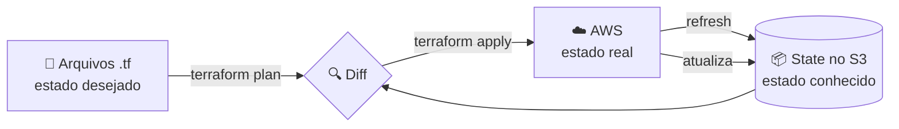

# Terraform — conceitos e anatomia dos arquivos

Referência conceitual do [Projeto Final](../README.md): o que o Terraform faz,
como ele decide o que fazer, e o passeio arquivo por arquivo pelo código de
[`terraform/`](../terraform/).

O par desta página é [Ansible — conceitos e anatomia dos arquivos](ansible.md).
As duas ferramentas convergem para um estado desejado por caminhos opostos — o
Terraform ordena o trabalho por um grafo de dependências e lembra do passado
pelo state; o Ansible executa literalmente de cima para baixo e pergunta ao
host toda vez. Ler as duas em sequência é o jeito mais rápido de ver onde uma
termina e a outra começa.

- [Como o Terraform funciona](#como-o-terraform-funciona)
- [Anatomia dos arquivos `.tf`](#anatomia-dos-arquivos-tf)

---

## Como o Terraform funciona

O Terraform é **declarativo**: descrevemos o *estado desejado* em arquivos `.tf`.
Ele compara esse desejo com o **state** (o registro do que já foi criado) e
calcula o conjunto mínimo de mudanças para convergir os dois.



| Comando | O que faz |
| --- | --- |
| `terraform init` | Baixa providers e conecta no backend. Obrigatório após mexer em `module` ou `backend` |
| `terraform validate` | Checa sintaxe e tipos **sem** acessar a AWS |
| `terraform fmt` | Formata `.tf` e `.tfvars` no padrão canônico |
| `terraform plan` | Mostra o diff entre código, state e realidade |
| `terraform apply` | Executa o diff |
| `terraform destroy` | Remove tudo que está no state do workspace atual |

> [!IMPORTANT]
> **Por que o state é remoto.** O `terraform.tfstate` local não é compartilhável,
> morre junto com a máquina e guarda dados sensíveis em texto plano no diretório de
> trabalho. O S3 resolve durabilidade e compartilhamento; o **lock** resolve
> concorrência, porque dois `apply` simultâneos sobre o mesmo state corrompem a infra.

Este projeto usa `use_lockfile = true`, o lock **nativo do S3** disponível a partir
do Terraform 1.10. Ele cria um objeto `.tflock` ao lado do state durante a operação.
A tabela DynamoDB exigida em materiais mais antigos não é necessária.

**Referências oficiais:**

- [Backend S3 e state locking][backend-s3]
- [Workspaces][workspaces-docs]
- [Módulos][modules-docs]

[backend-s3]: https://developer.hashicorp.com/terraform/language/backend/s3
[workspaces-docs]: https://developer.hashicorp.com/terraform/language/state/workspaces
[modules-docs]: https://developer.hashicorp.com/terraform/language/modules

---

## Anatomia dos arquivos `.tf`

Sete arquivos na raiz de `terraform/` e dois módulos. A separação
não é exigência do Terraform — ele lê todos os `.tf` do diretório como se
fossem um só — mas é o que permite abrir o arquivo certo quando algo muda.

### A ordem dos arquivos não existe

Os nomes `main.tf`, `variables.tf` e `outputs.tf` são **convenção para humanos**.
Um único arquivo com tudo dentro funcionaria igual, só que ilegível. E um
`local` definido em `locals.tf` é usado em `main.tf` sem nenhum `import`: o que
existe é o **grafo de dependências**, não a ordem de leitura.

### Os blocos usados neste projeto

| Bloco | Arquivo | Papel | O que pode referenciar |
| --- | --- | --- | --- |
| `terraform` | `versions.tf`, `backend.tf` | Versões e onde mora o state | nada (só literais) |
| `provider` | `providers.tf` | Como falar com a AWS | `var`, `local`, `terraform.workspace` |
| `variable` | `variables.tf` | Entrada do usuário | nada, exceto `var.*` na `validation` |
| `locals` | `locals.tf` | Valor derivado | `var`, outros `local`, `terraform.workspace` |
| `resource` | `main.tf`, módulos | Cria algo na AWS | tudo |
| `module` | `main.tf` | Compõe um conjunto de recursos | tudo |
| `output` | `outputs.tf` | Devolve valor a quem executa | tudo |

### Arquivo por arquivo

<details>
<summary><b>1. <code>versions.tf</code></b>: o contrato de versões</summary>

```hcl
terraform {
  required_version = ">= 1.10.0"

  required_providers {
    aws = {
      source  = "hashicorp/aws"
      version = "~> 6.0"
    }
  }
}
```

O piso `1.10` não é decorativo: é a versão que introduziu o `use_lockfile` do
backend S3, usado no arquivo seguinte. O `~> 6.0` aceita `6.x` e recusa `7.0`,
para uma major nova do provider não quebrar o projeto sem decisão explícita.

A versão **exata** que foi usada fica no `.terraform.lock.hcl`, versionado junto.
Este arquivo diz o que é aceitável; o lock diz o que aconteceu.

</details>

<details>
<summary><b>2. <code>backend.tf</code></b>: onde o state mora</summary>

```hcl
terraform {
  backend "s3" {
    bucket       = "tfstate-pos-devops-iac-weynne-2026"
    key          = "projeto-final/terraform.tfstate"
    region       = "us-east-1"
    encrypt      = true
    use_lockfile = true
  }
}
```

A `key` é o dado mais importante do arquivo: ela é distinta da usada pela
Atividade 1. Mesmo bucket, um state por entrega — reaproveitar a key faria o
primeiro `apply` daqui sobrescrever o state de uma entrega já avaliada.

Nenhum valor aqui pode ser `var`: o backend é lido **antes** de qualquer
variável existir, então só aceita literais. Para apontar para outro bucket,
use `terraform init -backend-config="bucket=..."`.

`use_lockfile = true` é o lock nativo do S3, que cria um objeto `.tflock` ao
lado do state durante a operação. A tabela DynamoDB exigida em materiais mais
antigos não é necessária.

</details>

<details>
<summary><b>3. <code>providers.tf</code></b>: como falar com a AWS</summary>

```hcl
provider "aws" {
  region = var.aws_region

  default_tags {
    tags = {
      Environment = terraform.workspace
      Project     = var.project_name
      Owner       = var.owner
      ManagedBy   = "Terraform"
    }
  }
}
```

Nenhuma credencial aqui, nunca. O provider resolve por ambiente,
`~/.aws/credentials` ou metadata da instância, nessa ordem.

O `default_tags` aplica as quatro tags a **todo** recurso taggável, inclusive
os criados dentro dos módulos. Nesta entrega isso deixou de ser só organização:
`Project` e `Environment` são o que o inventário dinâmico do Ansible consulta
para achar a máquina. O `Name` fica de fora de propósito — ele difere por
recurso e é mesclado em cada um.

</details>

<details>
<summary><b>4. <code>variables.tf</code></b>: a superfície de entrada</summary>

Sete variáveis; apenas `owner` e `ssh_ingress_cidr` são obrigatórias. Todo o
resto tem default versionado, então um clone novo roda com dois valores.

```hcl
variable "app_port" {
  description = "TCP port exposed publicly by the container"
  type        = number
  default     = 3000
}

variable "public_key_path" {
  description = "Path to the SSH public key registered as the EC2 key pair. Generate the pair with: ssh-keygen -t ed25519 -f ~/.ssh/projeto-final"
  type        = string
  default     = "~/.ssh/projeto-final.pub"
}
```

Repare no padrão das `description`: as boas dizem o que o nome não diz. A do
`public_key_path` traz o comando que **produz** o valor; a do
`ssh_ingress_cidr` traz o `curl` que descobre o IP. Uma description que apenas
repete o nome da variável é espaço desperdiçado.

`project_name` merece atenção: seu valor alimenta o prefixo de nome de todo
recurso **e** a tag `Project` que o Ansible filtra. Mudá-lo aqui sem mudar o
`aws_ec2.yml` faz o inventário voltar vazio.

</details>

<details>
<summary><b>5. <code>locals.tf</code></b>: o que é derivado, não informado</summary>

```hcl
locals {
  environment = terraform.workspace

  environment_config = {
    default = { instance_type = "t3.micro", vpc_cidr = "10.0.0.0/16" }
    dev     = { instance_type = "t3.micro", vpc_cidr = "10.10.0.0/16" }
    prod    = { instance_type = "t3.micro", vpc_cidr = "10.20.0.0/16" }
  }

  config      = local.environment_config[local.environment]
  name_prefix = "${var.project_name}-${local.environment}"
}
```

É o único lugar que decide o que difere entre ambientes. `variables.tf` recebe
o que o usuário informa; `locals.tf` calcula o que é consequência.

O índice direto (`local.environment_config[local.environment]`) em vez de
`lookup()` com default é proposital: um workspace fora do mapa é sempre erro, e
deve falhar alto em vez de silenciosamente cair num valor genérico.

`name_prefix` carrega o workspace, e é isso que torna o nome do key pair único
por ambiente — nomes de key pair são únicos por região, não por workspace.

</details>

<details>
<summary><b>6. <code>main.tf</code></b>: a composição</summary>

Três coisas: o guard, o par de chaves e os dois módulos.

```hcl
resource "terraform_data" "workspace_guard" {
  lifecycle {
    precondition {
      condition     = contains(["dev", "prod"], terraform.workspace)
      error_message = "Refusing to run in workspace '${terraform.workspace}'..."
    }
  }
}
```

`terraform_data` é built-in: sem provider, sem recurso na nuvem, sem custo.
A `precondition` é avaliada no **plan**, então bloqueia o `apply` sem impedir
que `terraform validate` passe limpo.

```hcl
resource "aws_key_pair" "this" {
  key_name   = "${local.name_prefix}-key"
  public_key = file(pathexpand(var.public_key_path))
}
```

Só a metade pública chega à AWS: a privada fica em `~/.ssh` e nunca entra no
state. `pathexpand()` é obrigatório — `file()` não expande `~` sozinho.

```hcl
module "docker_host" {
  source = "./modules/docker-host"

  vpc_id    = module.network.vpc_id
  subnet_id = module.network.public_subnet_id
  key_name  = aws_key_pair.this.key_name
  # ...
}
```

Não há `depends_on` em lugar nenhum. Referenciar `module.network.vpc_id` e
`aws_key_pair.this.key_name` **é** a declaração de dependência: o Terraform
infere a ordem do grafo. `depends_on` só é necessário quando existe dependência
real sem referência no código.

</details>

<details>
<summary><b>7. <code>outputs.tf</code></b>: o que o projeto devolve</summary>

```hcl
output "app_url" {
  value = "http://${module.docker_host.public_ip}:${var.app_port}"
}

output "app_url_dns" {
  value = "http://${module.docker_host.public_dns}:${var.app_port}"
}

output "ssh_command" {
  value = "ssh -i ${trimsuffix(var.public_key_path, ".pub")} ec2-user@${module.docker_host.public_ip}"
}
```

As duas URLs carregam a porta explicitamente porque o Security Group abre
apenas 22 e 3000: um endereço sem `:3000` cai na 80 e resulta em timeout.

`ssh_command` deriva o caminho da chave privada de `public_key_path` com
`trimsuffix`, em vez de repetir o caminho — assim o comando não tem como
divergir da chave que a instância de fato aceita.

`workspace` e `instance_type` existem para que cada log de `apply`/`destroy`
se identifique sozinho, o que importa quando a saída vira evidência.

</details>

<details>
<summary><b>8. <code>modules/network/</code></b>: VPC, subnet e saída para a internet</summary>

Reaproveitado da Atividade 1 sem uma linha de diferença. Cria VPC, subnet
pública, Internet Gateway, route table, rota e associação.

```hcl
resource "aws_vpc" "this" {
  cidr_block           = var.vpc_cidr
  enable_dns_support   = true
  enable_dns_hostnames = true
}
```

Os dois `enable_dns_*` são `false` por padrão numa VPC customizada. Sem
`enable_dns_hostnames`, `aws_instance.public_dns` volta **vazio** — e o
`app_url_dns` deixaria de funcionar sem nenhuma mensagem de erro.

A subnet sai de `cidrsubnet(var.vpc_cidr, 8, 0)`: `/16` + 8 bits = `/24`.

> A `aws_route_table_association` é o que de fato torna a subnet pública.
> Sem ela o `apply` termina com sucesso, todos os recursos existem, e nada
> responde.

</details>

<details>
<summary><b>9. <code>modules/docker-host/</code></b>: firewall, chave e a instância crua</summary>

Deriva do `web-server` da Atividade 1. O cabeçalho do arquivo declara a
decisão que o define:

```hcl
# A bare host on purpose: no user_data, no packages, no application. Terraform
# installing software mixes the same responsibilities as provisioner
# "remote-exec" -- everything inside the instance belongs to Ansible.
```

Security Group com três regras separadas — SSH restrito ao `/32` do operador,
`app_port` aberta e egress liberado:

```hcl
resource "aws_vpc_security_group_ingress_rule" "app" {
  from_port   = var.app_port
  to_port     = var.app_port
  ip_protocol = "tcp"
  cidr_ipv4   = "0.0.0.0/0"
}
```

Regras como recursos separados, e não blocos `ingress` embutidos: alterar uma
regra não recria o grupo inteiro.

A instância:

```hcl
resource "aws_instance" "this" {
  ami           = data.aws_ssm_parameter.ami.insecure_value
  instance_type = var.instance_type
  key_name      = var.key_name

  metadata_options {
    http_endpoint = "enabled"
    http_tokens   = "required"      # IMDSv2 obrigatório
  }

  root_block_device {
    encrypted   = true
    volume_type = "gp3"
  }

  tags = merge(var.tags, {
    Name = "${var.name_prefix}-host-instance"
    Role = "docker-host"
  })
}
```

Nenhum `user_data`. A AMI vem do SSM Parameter Store, sempre a última Amazon
Linux 2023, e `insecure_value` em vez de `value` porque `.value` é marcado como
sensível mesmo para parâmetros públicos — o que esconderia o ID da AMI no plano
que vira evidência.

A tag `Role` é a única linha deste módulo que existe por causa do Ansible.

</details>

---

← Voltar para o [README do Projeto Final](../README.md).
